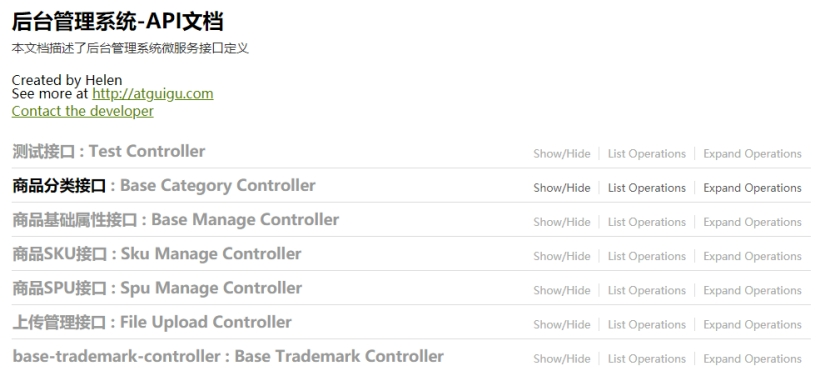

# 第一部分 搭建基础环境

## 相关技术在线文档

> vue3: https://staging-cn.vuejs.org/
>
> element-plus: https://element-plus.gitee.io/zh-CN/
>
> vue-router4: https://router.vuejs.org/zh/
>
> pinia: https://pinia.web3doc.top/
>
> TS: https://www.tslang.cn/docs/handbook/basic-types.html
>
> Vite: https://cn.vitejs.dev/
>

## 1. 后台管理模板项目

### 1.1. 了解相关

1. vue-admin-template: 这是一个非常流行的，极简的**后台管理模板项目**

   技术栈: **js + vue2 + vue-router3 + vuex + element-ui**

2. 我们的模板项目是此项目的升级版本

   技术栈: **ts + vue3 + vue-router4 + pinia + element-plus +axios**

3. 我们的项目在此模板项目上进行**二次开发**

4. Github地址:  ???

  5. 下载 ==> 安装依赖 ==> 运行项目			 


6. 潘家诚还提供了更大而全的模板项目, 公司的项目也可能在这基础上开发

   https://github.com/PanJiaChen/vue-element-admin

### 1.2. 源码目录结构

```
|-node_modules 依赖包
|-public  包含会被自动打包到项目根路径的文件夹
	|-favicon.ico  页面标题图标
	|-static/logo.png 应用Logo图片
|-src
	|-assets  组件中需要使用的公用资源
		|-404_images  404页面的图片
		|-bg.jpg	    登陆背景图片
	|-components  公共非路由组件
		|-Breadcrumb 面包屑组件(头部水平方向的层级组件)
		|-Hamburger  用来点击切换左侧菜单导航的图标组件
		|-SvgIcon    svg图标组件
	|-hooks	自定义hook模块
		|-useResize.ts  处理应用在不同屏幕下的适应问题
	|-layout 管理界面整体布局(一级路由)
		|-components  组成整体布局的一些子组件
		|-index.vue  后台管理的整体界面布局组件
	|-router
		|-index.ts  路由器
		|-routes.ts	路由表
	|-stores
		|-interface/index.ts state数据接口
		|-app.js  管理应用相关数据
		|-settings.js  管理设置相关数据
		|-userInfo.js  管理后台登陆用户相关数据
		|-index.js  pinia的store
	|-styles
		|-xxx.scss  项目组件需要使用的一些样式(使用scss)
	|-utils  一些工具函数
		|-get-page-title.js  得到要显示的网页title
		|-token-utils.js  操作登陆用户的token cookie
		|-request.js axios 二次封装的模块
		|-validate.js  检验相关工具函数
	|-views  路由组件文件夹
		|-error/404.vue 404页面 
		|-home  首页
		|-login  登陆
	|-App.vue  应用根组件
	|-main.ts  入口js
	|-permission.ts  使用全局守卫实现路由权限控制的模块
	|-settings.ts  包含应用设置信息的模块
|-.env 通用的环境配置
|-.env.development  指定了开发环境的代理服务器前缀路径
|-.env.production  指定了生产环境的代理服务器前缀路径
|-.eslintrc.cjs  eslint的检查配置
|-.gitignore  git的忽略配置
|-env.d.ts  让TS认知Vue的配置
|-index.html 唯一的页面
|-package-lock.json  当前项目依赖的第三方包的精确信息
|-package.json  当前项目包信息
|-README.md	git仓库的md文档
|-shims.d.ts	告诉TS, vue 文件是这种类型
|-tsconfig.config.json  TS的配置文件
|-tsconfig.json	TS的配置文件
|-vite.config.ts  vite相关配置(如: 代理服务器等)
```

```js
# 相对重要的部分
src 
  assets # 包含一些静态资源, 如图片
  components # 包含一些通用的非路由组件
  layout # 管理界面整体布局
  router # 路由相关
  store # pinia相关
		userInfo.ts  # 管理后台登陆用户相关数据
		index.ts  # pinia的store
  styles # 包含一些scss样式模块
  utils # 包含一些工具模块
    token-utils.ts # 存储token的模块
    request.ts # axios二次封装的模块
  views # 包含一些路由组件
    login/index.vue # 用户登陆路由组件
  App.vue # 应用根组件
  main.ts # 入口js
  permission.ts # 使用全局守卫做权限控制的模块
.env.development  # 配置开发环境的变量   代理前缀路径
.env.production # 配置生产环境的变量 代理前缀路径
tsconfig.json # 用于引入模块路径时, 加@后还可以提示
package-lock.json  # 保存了下载的依赖包的准确详细信息
vite.config.ts # vite配置   配置代理等
```

## 2. 项目接口文档与测试

### 2.1. 项目的所有接口文档

- 权限管理: http://39.98.123.211:8170/swagger-ui.html
- 商品管理：http://39.98.123.211:8510/swagger-ui.html

### 2.2. 接口在线测试工具Swagger

#### 1) 理解swagger

Swagger定义了一套规范，你(后台工程师)只需要按照它的规范去定义接口及接口相关的信息。再通过Swagger衍生出来的一系列项目和工具，就可以做到生成各种格式的接口文档，生成多种语言的客户端和服务端的代码，以及在线接口调试页面等等

 

#### 2) 使用Swagger测试接口

权限管理测试页面: http://39.98.123.211:8170/swagger-ui.html

 

商品管理测试页面: http://39.98.123.211:8510/swagger-ui.html

 

## 3. 实现 ”登陆&自动登陆&退出登陆”

接口文档:  http://39.98.123.211:8170/swagger-ui.html

管理员账号: admin / 111111

### 3.1. 登陆与自动登陆的基本流程


### 3.2. 配置代理

- vite.config.ts

```js
server: {
  host: '0.0.0.0', // 会映射多个域名地址
  port: 8000, // 默认起始端口号
  open: true, // 自动打开浏览器访问
  proxy: {
    '/app-dev': { // 代理所有以 '/app-dev'开头的请求路径
      // 后台接口地址
      // 备用网址:'http://sph-h5-api.atguigu.cn/' 
      target: 'http://gmall-h5-api.atguigu.cn/',
      // 服务器得到的就不是当前应用的域名了, 而是后台的域名
      changeOrigin: true,
      // 重写路径: 去掉路径中开头的'/dev-api'
      rewrite: (path) => path.replace(/^\/app-dev/, ''),
    },
  },
},
```

### 3.3. axios封装

- utils/request.js
- 理解请求拦截器与响应拦截器
- 请求自动携带token

```js
// 添加请求拦截器
service.interceptors.request.use(
	(config) => {
    const userInfoStore = useUserInfoStore(pinia)
		// 在发送请求之前做些什么 token
		if (userInfoStore.token) {
			(<any>config.headers)['token'] = userInfoStore.token;
		}
		return config;
	}
);
```

### 3.4. 登陆接口数据接口

- api/acl/model/userModel.ts

```tsx
/* 
登陆返回的数据
*/
export interface loginResponseModel {
  token: string
}

/* 
获取用户信息返回的数据
*/
export interface userInfoResponseModel {
  name: string
  avatar: string
  
  buttons: string[]
  roles: string[]
  routes: string[]
}
```


### 3.5. 登陆接口请求封装

- api/acl/user.ts

```tsx
import type { loginResponseModel, userInfoResponseModel } from './model/loginModel';
import request from '@/utils/request';

enum Api {
  Login = '/admin/acl/index/login',
  Logout = '/admin/acl/index/logout',
  getUserInfo = '/admin/acl/index/info',
}

/**
 * 登陆
 * @param username 用户名
 * @param password 密码
 * @returns loginResponseModel
 */
export const loginApi = (username: string, password: string) => {
  return request.post<any, loginResponseModel>(Api.Login, {username, password})
}

/**
 * 退出登陆
 * @returns 
 */
export const logoutApi = () => {
  return request.post<any, void>(Api.Logout)
}

/**
 * 获取用户信息
 * @returns userInfoResponseModel
 */
export const getUserInfoApi = () => {
  return request.get<any, userInfoResponseModel>(Api.getUserInfo)
}
```


### 3.6. 前台存储token

- utils/token-utils.js

```js
const TokenKey = 'atguigu_admin_token'

export function getToken() {
  return localStorage.getItem(TokenKey)
}

export function setToken(token: string) {
  return localStorage.setItem(TokenKey, token)
}

export function removeToken() {
  return localStorage.removeItem(TokenKey)
}

```

### 3.7. pinia管理用户信息

- stores/acl/user.ts

```tsx
actions: {
  /**
   * 登陆
   * @param username 
   * @param password 
   */
  async login (username: string, password: string) {
    const {token} = await loginApi(username, password)
    this.token = token
    setToken(token)
  },

  /**
   * 获取用户信息
   */
  async getInfo () {
    const info = await getUserInfoApi()
    this.name = info.name
    this.avatar = info.avatar
    
    this.menuRoutes = staticRoutes
  },

  /**
   * 重置/退出登陆
   */
  async reset () {
    // 如果当前是登陆的, 请求退出登陆
    if (this.name) {
      await logoutApi()
    }
    // 删除local中保存的token
    removeToken()
    // 提交重置用户信息的mutation
    this.token = ''
    this.name = ''
    this.avatar = ''
  },
},
```


### 3.8.  理解登陆&退出登陆&自动登陆

- views/login/index.vue  登陆
- layout/Navbar.vue        退出登陆
- permission.ts                自动登陆


### 3.9. 整体编码步骤如下

```js
/*
1. 配置代理服务器   vite.config.ts
2. 请求自动携带token请求头  utils/request.ts
3. 登陆接口请求函数	api/acl/user.ts(不用做)
4. 使用localStorage存储token utils/token-utils.ts
5. pinia管理登陆用户信息  stores/userInfo.ts(不用做)
*/
```


## 4. 搭建商品管理相关路由

### 4.1. 定义各个路由组件

- 整体目录结构

```
|-src
	|-views
		|-product
      |-category/index.vue
      |-trademark/index.vue
      |-attr/index.vue
      |-spu/index.vue
      |-sku/index.vue
```

- 组件文件示例

```vue
<template>
  <div>Trademark</div>
</template>

<script lang="ts">
export default {
  name: 'Trademark',
}
</script>

<script lang="ts" setup>

</script>

```

### 4.2. 注册路由

- src/router/routes.ts
- 直接在staticRoutes中注册就可以, 路由权限控制后面我们专门再讲解

- 删除部分默认提供的测试路由组件

```tsx
export const staticRoutes: Array<RouteRecordRaw> = [
	...
  ...
  ...

  /* 商品管理 start 该路由对象与/的对象是兄弟关系,同级 */
  {
    path: '/product',
    name: 'Product',
    component: () => import('@/layout/index.vue'),
    redirect: '/product/category/list',
    meta: {
      title: '商品管理',
      icon: 'ele-ShoppingBag',
    },
    children: [
      {
        name: 'Category',
        path: 'category/list',
        component: () => import("@/views/product/category/index.vue"),
        meta: {
          title: '分类管理',
        },
      },
      {
        name: 'Trademark',
        path: 'trademark/list',
        component: () => import("@/views/product/trademark/index.vue"),
        meta: {
          title: '品牌管理',
        },
      },
      {
        name: 'Attr',
        path: '/product/attr/list',
        component: () => import("@/views/product/attr/index.vue"),
        meta: {
          title: '平台属性管理',
        },
      },
      {
        name: 'Spu',
        path: '/product/spu/list',
        component: () => import("@/views/product/spu/index.vue"),
        meta: {
          title: 'SPU管理',
        },
      },
      {
        name: 'Sku',
        path: '/product/sku/list',
        component: () => import("@/views/product/sku/index.vue"),
        meta: {
          title: 'SKU管理',
        },
      },
    ],
  },
  /* 商品管理 end */

    
    
  /* 匹配任意的路由 必须最后注册 */
  { 
    path: '/:pathMatch(.*)', 
    name: 'Any',
    redirect: '/404', 
    meta: {
      hidden: true 
    }
  }
];
```

### 4.3. 运行查看效果


# 第二部分: 品牌管理

## 品牌数据接口

- api/product/model/trademarkModel.ts

```tsx
// 品牌
export interface TrademarkModel {
  id?: number;
  tmName: string;
  logoUrl: string;
}

// 品牌列表
export type TrademarkListModel = TrademarkModel[];

// 品牌分页列表返回数据
export interface TrademarkPageListModel {
  total: number;
  records: TrademarkListModel;
}
```


## 品牌接口

- api/product/trademark.ts

```tsx
// 引入发送请求的函数对象
import request from '@/utils/request';

// 引入响应返回值的数据类型
import type {
  TrademarkPageListModel,
  TrademarkModel,
  TrademarkListModel,
} from './model/trademarkModel';

// 定义请求地址的枚举
enum Api {
  GetTrademarkList = '/admin/product/baseTrademark',
  GetAllTrademarkList = '/admin/product/baseTrademark/getTrademarkList',
  SaveTrademark = '/admin/product/baseTrademark/save',
  DeleteTrademark = '/admin/product/baseTrademark/remove',
  UpdateTrademark = '/admin/product/baseTrademark/update',
}

/**
 * 获取所有品牌列表
 * @returns TrademarkListModel
 */
export const getAllTrademarkListApi = () => {
  return request.get<any, TrademarkListModel>(Api.GetAllTrademarkList);
};

/**
 * 获取品牌分页列表
 * @param page 当前页码
 * @param limit 每页条数
 * @returns TrademarkListResponseModel
 */
export const getTrademarkListApi = (page: number, limit: number) => {
  return request.get<any, TrademarkPageListModel>(Api.GetTrademarkList + `/${page}/${limit}`);
};

/**
 * 添加品牌
 * @param tmName 品牌名称
 * @param logoUrl 品牌logo
 * @returns null
 */
export const saveTrademarkApi = (tmName: string, logoUrl: string) => {
  return request.post<any, null>(Api.SaveTrademark, {
    tmName,
    logoUrl,
  });
};

/**
 * 更新品牌
 * @param tm 品牌对象
 * @returns null
 */
export const updateTrademarkApi = (tm: TrademarkModel) => {
  return request.put<any, null>(Api.UpdateTrademark, tm);
};

/**
 * 删除品牌
 * @param id 品牌id
 * @returns null
 */
export const deleteTrademarkApi = (id: number) => {
  return request.delete<any, null>(Api.DeleteTrademark + `/${id}`);
};
```

## 品牌管理路由

- trademark/index.vue

```vue
<template>
  <el-card shadow="hover">
    <template #header>
      <el-button type="primary" :icon="Plus" @click="showAdd">添加</el-button>
    </template>

    <el-table v-loading="loading" :data="trademarkList" row-key="id" border>
      <el-table-column label="序号" type="index" width="80" align="center" />

      <el-table-column prop="tmName" label="品牌名称" />

      <el-table-column label="品牌LOGO">
        <template v-slot="scope">
          
        </template>
      </el-table-column>

      <el-table-column label="操作">
        <template v-slot="{row, $index}">
          <el-button title="修改" type="warning" size="small" :icon="Edit" @click="showUpdate(row)"></el-button>
          <el-button title="删除" type="danger" size="small" :icon="Delete" @click="remove(row)"></el-button>
        </template>
      </el-table-column>
    </el-table>

    <el-pagination style="margin-top: 20px; text-align: center;" 
      v-model:currentPage="current"
      v-model:page-size="pageSize" 
      :page-sizes="[3, 6, 9]" 
      :total="total" 
      layout="prev, pager, next, jumper, ->, sizes, total" 
      @current-change="val => getTrademarkList(val, pageSize)"
      @size-change="val => getTrademarkList(1, val)" />

    <el-dialog :title="trademark.id ? '修改品牌' : '添加品牌'" v-model="visible" draggable>
      <el-form :model="trademark" :rules="rules" ref="formRef" style="width: 80%" label-width="100px">
        <el-form-item label="品牌名称" prop="tmName">
          <el-input v-model="trademark.tmName" autocomplete="off"></el-input>
        </el-form-item>
        <el-form-item label="品牌LOGO" prop="logoUrl">
          <!-- 
            show-file-list: 指定是否显示上传图片的列表, 如果是false, 只显示一张
            action: 处理上传图片请求的地址  ==> 通过代理解决跨域的问题
            on-success: 用来指定上传成功时的回调函数
            before-upload: 在准备发上传请求前调用, 如果返回false不发请求, 用来检查文件类型和大小
          -->
          <el-upload class="avatar-uploader" 
            :action="`${BASE_URL}/admin/product/fileUpload`" 
            :show-file-list="false"
            :on-success="handleAvatarSuccess" 
            :before-upload="beforeAvatarUpload">
            
            <el-icon v-if="uploadLoading" class="avatar-uploader-icon">
              <Loading />
            </el-icon>
            
            <el-icon v-else class="avatar-uploader-icon">
              <Plus />
            </el-icon>

            <template #tip>
              <div class="el-upload__tip">只能上传jpg/png文件，且不超过50kb</div>
            </template>
          </el-upload>
        </el-form-item>
      </el-form>
      <template #footer>
        <div class="dialog-footer">
          <el-button @click="visible = false">取 消</el-button>
          <el-button type="primary" @click="addOrUpdate">确 定</el-button>
        </div>
      </template>
    </el-dialog>
  </el-card>
</template>

<script lang="ts" setup>

import { reactive, ref, onMounted, nextTick } from 'vue'
import {
  getTrademarkListApi,
  saveTrademarkApi,
  deleteTrademarkApi,
  updateTrademarkApi,
} from '@/api/product/trademark';
import type { TrademarkListModel, TrademarkModel } from '@/api/product/model/trademarkModel'
import type { UploadProps } from 'element-plus'
import { ElMessage, ElMessageBox } from "element-plus"
import {Loading, Plus, Edit, Delete} from '@element-plus/icons-vue'
import type { FormInstance, FormRules } from 'element-plus'

// 上传图片地址：从.env.development中加载的
const BASE_URL = import.meta.env.VITE_API_URL;

// 品牌列表数据
const trademarkList = ref<TrademarkListModel>([]);
// table是否loading
const loading = ref<boolean>(false);
// 当前页码
const current = ref<number>(1);
// 每页条数
const pageSize = ref<number>(3);
// 总数
const total = ref<number>(0);

// 对话框
const visible = ref<boolean>(false);
// 收集的数据表单的品牌对象
let trademark = reactive<TrademarkModel>({
  tmName: '', // 品牌名称
  logoUrl: '', // 图片地址
});

// 用于存储form对象的ref => 用于表单统一校验
const formRef = ref<FormInstance>();
/**
 * 自定义校验
 * @param rule 
 * @param value 
 * @param callback 
 */
const validateTmName = (rule: any, value: any, callback: any) => {
  if (value.length<2 || value.length>10) {
    // callback(new Error('长度必须在2-10个之间'))
    callback('长度必须在2-10个之间2')  // 不通过
  } else {
    callback() // 通过
  }
}
// 校验规则
const rules: FormRules = {
  tmName: [{
      required: true,
      message: '请输入名称',
      // trigger: 'change'  // 默认就是change, 也就是输入过程中触发检查
    },
    // 使用内置校验规则实现
    /* 
    {
      min: 2,
      max: 10,
      message: '长度必须在2-10个之间',
      trigger: 'blur' // 触发校验的时机是失去焦点
    } */
    // 使用自定义验证
    {
      validator: validateTmName,
      trigger: 'blur' // 触发校验的时机是失去焦点
    }
  ],
  logoUrl: [{
    required: true,
    message: 'LOGO必须指定',
  }],
}


// 初始化获取分页列表显示
onMounted(() => {
  getTrademarkList();
});

/**
 * 获取品牌分页列表
 * @param page 页码
 * @param limit 每页数量
 */
const getTrademarkList = async (page: number=current.value, limit: number=pageSize.value) => {
  loading.value = true;
 
  const result = await getTrademarkListApi(page, limit);
  
  loading.value = false;
  current.value = page;
  pageSize.value = limit;
  total.value = result.total;
  trademarkList.value = result.records;
  
  ElMessage.success('获取品牌分页列表成功');
};

/**
 * 显示添加界面
 */
const showAdd = () => {
  // 清除/重置form中的数据
  trademark.id = undefined
  trademark.tmName = ''
  trademark.logoUrl = ''

  // 显示dialog
  visible.value = true

  // 在显示了提示信息后, 立即清除提示信息
  // 此时dialog界面还没有显示 ==> 必须延迟到界面更新显示后再执行
  nextTick(() => {// 回调函数是迟延到界面更新后执行的   面试说
    formRef.value?.clearValidate()
  })
}

/**
 * 显示更新界面
 * @param row 品牌对象
 */
const showUpdate = (row: TrademarkModel) => {
  // 保存要修改的品牌
  const {id, tmName, logoUrl} = row
  // trademark.id = id
  // trademark.tmName = tmName
  // trademark.logoUrl = logoUrl
  Object.assign(trademark, row)

  // 显示dialog
  visible.value = true
}

/**
 * 删除品牌
 * @param row 品牌对象
 */
const remove = (row: TrademarkModel) => {
  ElMessageBox.confirm(`确定删除 ${row.tmName} 吗?`, '提示', {
    type: 'warning'
  }).then(async () => { // 点击确定的回调
    // 发删除品牌的请求
    await deleteTrademarkApi(row.id as number)
    // 如果成功了, 提示成功, 重新获取列表(哪一页?)
    ElMessage({
      type: 'success',
      message: '删除成功!'
    })

    // 哪一页?  显示上一页(当前页的列表数据只剩下1个)  否则显示当前页 
    // 如果当前是第1页且只剩下1条数据 ==> 请求第1页数据(当前页)
    if (trademarkList.value.length === 1 && current.value > 1) {
      current.value -= 1
    }
    getTrademarkList()
  }).catch((error) => { // 点击取消的回调
    if (error==='cancel') {
      ElMessage({
        type: 'info',
        message: '已取消删除'
      })
    }
  })
}

/**
 * 添加或更新品牌
 */
const addOrUpdate = () => {
  // 对所有表单项进行统一校验
  return formRef.value?.validate(async valid => { // 校验完成的回调
    // 如果通过, 才进行后面请求的操作
    if (valid) {
      let result
      // 提交请求
      if (trademark.id) { // 更新
        result = await updateTrademarkApi(trademark)
      } else { // 添加
        result = await saveTrademarkApi(trademark.tmName, trademark.logoUrl)
      }
      // 如果成功, 提示成功, 并获取新的列表显示
      ElMessage.success('保存成功!')
      // 关闭当前dialog
      visible.value = false
      // 重新获取列表显示()
      // 哪一页?  更新显示当前页, 添加显示第一页
      getTrademarkList(trademark.id? current.value : 1)
    } else { // 可以不用写
      console.log('校验不通过')
    }
  }).then(
    
  )
}

// 是否正在上传图中
const uploadLoading = ref<boolean>(false);
/* 
上传成功时的回调函数
res: 上传请求返回的响应体数据对象  {code: 200, data: 图片url}
*/
const handleAvatarSuccess: UploadProps['onSuccess'] = (res, file) => {
  // console.log('handleAvatarSuccess()', res)
  // 保存请求返回的图片url数据
  trademark.logoUrl = res.data
  console.log(res.data, '====')
  uploadLoading.value = false
  // 对logoUrl进行表单校验
  formRef.value?.validateField('logoUrl')
  // formRef.value?.clearValidate('logoUrl')
}

/* 
在准备发上传请求前调用, 如果返回false不发请求, 用来检查文件类型和大小
对图片的要求: 
  类型: jpg/png  ===> image/jpeg | image/png
  大小: <50K
*/
const beforeAvatarUpload: UploadProps['beforeUpload'] = (file) => {
  // const isJPGOrPNG = file.type === 'image/jpeg' || file.type === 'image/png'   // 利用数组来判断
  const isJPGOrPNG = ['image/jpeg', 'image/png'].indexOf(file.type) >= 0
  const isLt50K = file.size / 1024 < 50

  if (!isJPGOrPNG) {
    ElMessage.error('上传头像图片只能是 JPG/PNG 格式!');
    return false
  }
  if (!isLt50K) {
    ElMessage.error('上传头像图片大小不能超过 50K!');
    return false
  }

  uploadLoading.value = true

  return true
}

</script>

<style scoped>
.avatar-uploader .avatar {
  width: 178px;
  height: 178px;
  display: block;
}
</style>

<style>
.avatar-uploader .el-upload {
  border: 1px dashed var(--el-border-color);
  border-radius: 6px;
  cursor: pointer;
  position: relative;
  overflow: hidden;
  transition: var(--el-transition-duration-fast);
}

.avatar-uploader .el-upload:hover {
  border-color: var(--el-color-primary);
}

.el-icon.avatar-uploader-icon {
  font-size: 28px;
  color: #8c939d;
  width: 178px;
  height: 178px;
  text-align: center;
}
</style>

```


# 第三部分: 平台属性管理

## 分类数据接口

- api/product/model/categoryModel.ts

```tsx
// 分类
export interface CategoryModel {
  id: number;
  name: string;

  // 页面显示需要
  hasChildren?: boolean; // 标识是否有子分类
  level?: number // 标识是第几级分类
}

// 分类列表
export type CategoryListModel = CategoryModel[];

// number和undefined 类型别名
export type Numberable = number | undefined

// 三个级别分类id => 用于约束请求接口的条件参数
export interface CategoryIdsModel {
  category1Id: Numberable;
  category2Id: Numberable;
  category3Id: Numberable;
}
```


## 平台属性数据接口

- api/product/model/attrModel.ts

```tsx
// 平台属性值接口
export interface AttrValueModel {
  id?: number;
  valueName: string;
  attrId?: number;
  isShowEdit?: boolean; // 标识是否显示ipput
}

// 平台销售值列表
export type AttrValueListModel = AttrValueModel[];

// 平台属性
export interface AttrModel {
  id?: number;
  
  attrName: string;
  categoryId: number;
  categoryLevel: number;
  attrValueList: AttrValueListModel;
}

// 平台属性列表
export type AttrListModel = AttrModel[];

// Pick从AttrModel类型中挑选一些类型组成一个新类型
// export type PickAttrModel = Pick<AttrModel, 'attrName' | 'attrValueList' | 'id'>;
```


## 分类接口

- api/product/category.ts

```tsx
// 引入发送请求的函数对象
import request from '@/utils/request';
// 引入响应返回值的数据类型
import { CategoryListModel } from './model/categoryModel';

// 定义请求地址的枚举
enum Api {
  GetCategory1List = '/admin/product/getCategory1',
  GetCategory2List = '/admin/product/getCategory2',
  GetCategory3List = '/admin/product/getCategory3',
}

/**
 * 获取一级分类
 * @returns CategoryListModel
 */
export const getCategory1ListApi = () => {
  return request.get<any, CategoryListModel>(Api.GetCategory1List);
};

/**
 * 获取二级分类
 * @param category1Id 一级分类id
 * @returns CategoryListModel
 */
export const getCategory2ListApi = (category1Id: number) => {
  return request.get<any, CategoryListModel>(Api.GetCategory2List + `/${category1Id}`);
};

/**
 * 获取三级分类
 * @param category2Id 二级分类id
 * @returns CategoryListModel
 */
export const getCategory3ListApi = (category2Id: number) => {
  return request.get<any, CategoryListModel>(Api.GetCategory3List + `/${category2Id}`);
};
```


## 平台属性接口

- api/product/attr.ts

```tsx
import request from '@/utils/request';
import type { CategoryIdsModel } from './model/categoryModel';
import type { AttrListModel, AttrModel } from './model/attrModel';

// 定义请求地址的枚举
enum Api {
  GetAttrList = '/admin/product/attrInfoList',
  AddOrUpdateAttr = '/admin/product/saveAttrInfo',
  DeleteAttr = '/admin/product/deleteAttr'
}

/**
 * 获取属性列表
 * @param categoryIds 三级分类id对象
 * @returns AttrListModel
 */
export const getAttrListApi = ({
  category1Id,
  category2Id,
  category3Id,
}: CategoryIdsModel) => {
  return request.get<any, AttrListModel>(Api.GetAttrList + `/${category1Id}/${category2Id}/${category3Id}`);
};

/**
 * 添加或更新属性
 * @param attr 属性对象
 * @returns null
 */
export const addOrUpdateAttrApi = (attr: AttrModel) => {
  return request.post<any, null>(Api.AddOrUpdateAttr, attr);
};

/**
 * 删除属性
 * @param id
 * @returns null
 */
export const deleteAttrApi = (id: number) => {
  return request.delete<any, null>(Api.DeleteAttr + `/${id}`)
};
```

## pinia管理分类数据

- stores/category.ts

```tsx
import { defineStore } from 'pinia'
import {
  getCategory1ListApi,
  getCategory2ListApi,
  getCategory3ListApi,
} from '@/api/product/category'
import type { CategoryIdsModel, Numberable, CategoryListModel } from '@/api/product/model/categoryModel'

// pinia管理的分类状态
export interface CategoryStateModel extends CategoryIdsModel {
  category1List: CategoryListModel;
  category2List: CategoryListModel;
  category3List: CategoryListModel;
}

/* 
管理商品分类数据
*/
export const useCategoryStore = defineStore({
  id: 'category',
  
  // state 数据可读可写
  state: (): CategoryStateModel => ({
    category1Id: undefined,
    category2Id: undefined,
    category3Id: undefined,
    category1List: [],
    category2List: [],
    category3List: []
  }),

  // getters 只读的计算属性数据
  getters: {
    getCategory1Id(): Numberable {
      return this.category1Id
    },
    getCategory2Id(): Numberable {
      return this.category2Id
    },
    getCategory3Id(): Numberable {
      return this.category3Id
    },
    getCategory1List(): CategoryListModel {
      return this.category1List
    },
    getCategory2List(): CategoryListModel {
      return this.category2List
    },
    getCategory3List(): CategoryListModel {
      return this.category3List
    },
  },

  // actions 发送请求更新数据的方法
  // Tip: 如果只需要直接更新数据，直接更新state就OK了
  actions: {
    // 请求获取一级分类
    async setCategory1List() {
      this.category1List = await getCategory1ListApi()
    },

    // 请求获取二级分类列表
    async setCategory2List(category1Id: number) {
      this.category1Id = category1Id
      this.category2List = await getCategory2ListApi(category1Id)
      // 清空数据
      this.category2Id = undefined
      this.category3Id = undefined
      this.category3List = []
    },

    // 请求获取三级分类列表
    async setCategory3List(category2Id: number) {
      this.category2Id = category2Id
      this.category3List = await getCategory3ListApi(category2Id)
      this.category3Id = undefined
    },
  },
})

export default useCategoryStore
```


## 三级分类选择组件

- components/CategorySelector/index.vue

```vue
<template>
  <el-form inline>
    <el-form-item label="一级分类">
      <el-select v-model="category1Id" :disabled="disabled">
        <el-option v-for="item in categoryStore.category1List" :key="item.id" :label="item.name" :value="item.id"></el-option>
      </el-select>
    </el-form-item>
    <el-form-item label="二级分类">
      <el-select v-model="category2Id" :disabled="disabled">
        <el-option v-for="item in categoryStore.category2List" :key="item.id" :label="item.name" :value="item.id"></el-option>
      </el-select>
    </el-form-item>
    <el-form-item label="三级分类">
      <el-select v-model="categoryStore.category3Id" :disabled="disabled">
        <el-option v-for="item in categoryStore.category3List" :key="item.id" :label="item.name" :value="item.id"></el-option>
      </el-select>
    </el-form-item>
  </el-form>
</template>

<script lang="ts" setup>
  import {ElForm, ElFormItem, ElSelect, ElOption} from 'element-plus'
  import { onMounted, computed } from 'vue'
  import { useCategoryStore } from '@/stores/category';

  // 定义接收的属性
  const props = defineProps({
    disabled: {
      default: false,
      type: Boolean
    }
  })

  // 组件使用pinia中的分类数据
  const categoryStore = useCategoryStore();

  // 定义一级分类ID的getter/setter
  const category1Id = computed<number>({
    get() {
      return categoryStore.getCategory1Id as number;
    },
    async set(val) {
      categoryStore.setCategory2List(val)
    },
  });

  // 定义二级分类ID的getter/setter
  const category2Id = computed<number>({
    get() {
      return categoryStore.getCategory2Id as number;
    },
    async set(val) {
      categoryStore.setCategory3List(val);
    },
  });

  // 初始化获取一级分类列表显示
  onMounted(async () => {
    categoryStore.setCategory1List()
  });

</script>
```


## 属性管理路由组件

- views/product/attr/index.vue

```vue
<template>
  <div>
    <el-card style="margin-bottom: 10px">
      <category-selector :disabled="!isShowAttrList"/>
    </el-card>

    <el-card>
      <div v-if="isShowAttrList">
        <el-button type="primary" :icon="Plus" :disabled="!categoryStore.getCategory3Id" 
          @click="showAdd">添加属性</el-button>
        <el-table
          :data="attrList"
          border
          row-key="id">
          <el-table-column
            label="序号"
            type="index"
            width="80"
            align="center">
          </el-table-column>
          <el-table-column
            prop="attrName"
            label="属性名称"
            width="150">
          </el-table-column>
          <el-table-column
            label="属性值列表">
            <template v-slot="{row}">
              <el-tag style="margin-right: 5px" type="success" v-for="item in row.attrValueList" :key="item.id">{{item.valueName}}</el-tag>
            </template>
          </el-table-column>
          <el-table-column
            label="操作"
            width="150">
            <template v-slot="{row}">
              <el-button style="margin-right: 10px" @click="showUpdate(row)" title="修改属性" 
                type="primary" :icon="Edit" size="small"></el-button>
              <el-popconfirm
                :title="`确定删除${row.attrName}吗?`"
                @confirm="remove(row.id)"
              >
                <template #reference>
                  <el-button title="删除属性" type="danger" :icon="Delete" size="small"></el-button>
                </template>
              </el-popconfirm>
            </template>
          </el-table-column>
        </el-table>
      </div>
      <div v-else>
        <span>属性名</span>
        <el-input style="width: 200px;margin-left: 20px" v-model="attr.attrName" placeholder="请输入属性名"></el-input>
        <br>

        <div style="margin: 20px 0">
          <el-button :disabled="!attr.attrName" type="primary" icon="el-icon-plus" @click="addValue">添加属性值</el-button>
          <el-button @click="isShowAttrList = true">取消</el-button>
        </div>

        <el-table
          style="margin-bottom: 20px"
          :data="attr.attrValueList"
          v-loading="loading">
          <el-table-column
            label="序号"
            type="index"
            width="80">
          </el-table-column>
          <el-table-column
            label="属性值名称">
            <template v-slot="{row, $index}">
              <el-input 
                :ref="(input: any) => inputsRef[$index] = input" 
                @blur="showSpan(row, $index)" 
                v-model="row.valueName" 
                v-if="row.isShowEdit" size="small"></el-input>
              <span style="display: inline-block;width: 100%;" 
                v-else @click="showInput(row, $index)">{{row.valueName}}</span>
            </template>
          </el-table-column>
          <el-table-column
            label="操作" >
            <template v-slot="{row, $index}">
              <el-popconfirm
                :title="`确定删除${row.valueName}吗?`"
                @confirm="() => {attr.attrValueList.splice($index, 1)}"
              > 
                <template #reference>
                  <el-button title="删除" type="danger" :icon="Delete" size="small"></el-button>
                </template>
              </el-popconfirm>
            </template>
          </el-table-column>
        </el-table>

        <el-button type="primary" @click="save" :disabled="isSaveDisabled">保存</el-button>
        <el-button @click="isShowAttrList = true">取消</el-button>
      </div>
    </el-card>
  </div>
</template>

<script lang="ts">
  export default {
    name: 'Attr',
  }
</script>

<script lang="ts" setup>
  import cloneDeep from 'lodash/cloneDeep'
  import { nextTick, computed, ref, reactive, watch } from 'vue'
  import { ElCard, ElButton, ElTable, ElTableColumn, ElPopconfirm, ElInput, ElTag, ElMessage } from 'element-plus';
  import { Plus, Edit, Delete } from '@element-plus/icons-vue';
  import CategorySelector from '@/components/CategorySelector/index.vue'
  import type { AttrListModel, AttrModel, AttrValueModel } from '@/api/product/model/attrModel';
  import { getAttrListApi, addOrUpdateAttrApi, deleteAttrApi } from '@/api/product/attr';
  import { useCategoryStore } from '@/stores/category';

  const categoryStore = useCategoryStore();
  const loading = ref(false)
  const attrList = ref<AttrListModel>([])
  const attr = reactive<AttrModel>({ // 要添加或更新的属性对象
    attrName: '', // 属性名
    attrValueList: [], // 属性值列表
    categoryId: -1,
    categoryLevel: 3
  })
  const isShowAttrList = ref<boolean>(true);
  const inputsRef = ref<HTMLInputElement[]>([])

  /* 
  获取属性列表显示
  */
  const getAttrList = async () => {
    loading.value = true;
    attrList.value = await getAttrListApi({
      category1Id: categoryStore.category1Id as number,
      category2Id: categoryStore.category2Id as number,
      category3Id: categoryStore.category3Id as number,
    });
    loading.value = false;
  }

  // 等category3Id有值的时候才需要发送请求
  watch(
    // 监视的数据
    () => categoryStore.category3Id,
    // 触发的函数
    async (category3Id) => {
      if (!category3Id) {
        attrList.value = [];
        return;
      }
      getAttrList()
    },
    // 一上来触发
    // 从添加属性组件切换回来时会触发
    { immediate: true },
  );


  // 计算保存按钮是否是禁用
  const isSaveDisabled = computed(() => {
    const {attrName, attrValueList} = attr
    const hasName = !!attrName
    const hasValue = attrValueList.some(attrValue => attrValue.valueName)
    return !hasName || !hasValue
  })


  /**
   * 删除属性
   * @param id 
   */
  const remove = async (id: number) => {
    await deleteAttrApi(id)
    ElMessage.success('删除成功')
    getAttrList()
  }

  /* 
  保存要添加或更新的属性
  */
  const save = async () => {
    // 添加必要的属性
    attr.categoryId = categoryStore.category3Id as number

    // 对要提交的数据进行特定处理/整理操作(开发经常做)
    // 处理1: 过滤掉没有属性值名称的属性值对象
    // 处理2: 删除属性值对象中的edit属性
    attr.attrValueList = attr.attrValueList.filter(value => {
      if (value.valueName) {
        delete value.isShowEdit
        return true
      }
      return false
    })

    // 发请求
    await addOrUpdateAttrApi(attr)
    // 提示
    ElMessage.success('保存成功')
    // 回到列表页面
    isShowAttrList.value = true
    // 重新获取列表显示
    getAttrList()
  }

  /**
   * 添加一个属性值
   */
  const addValue = () => {
    // 向attr.attrValueList中添加一个属性值对象:
    attr.attrValueList.push({
      valueName: '',
      attrId: attr.id,
      isShowEdit: true
    })
    // 自动获取焦点:
    nextTick(() => {
      inputsRef.value[attr.attrValueList.length-1].focus()
    })
  }

  /**
   * 显示文本
   * @param row 属性值对象
   * @param index 下标
   */
  const showSpan = (row: AttrValueModel, index: number) => {
    // 如果没有输入, 删除这条数据
    if (!row.valueName) {
      attr.attrValueList.splice(index, 1);
      return
    }
    // 变为查看模式
    row.isShowEdit = false
  }

  /**
   * 显示输入框
   * @param row  属性值对象
   * @param index 下标
   */
  const showInput = (row: AttrValueModel, index: number) => {
    // 显示输入框
    row.isShowEdit = true

    // 显示输入框后, 自动获取焦点
    nextTick(() => {
      inputsRef.value[index].focus()
    })
  }

  /**
   * 显示添加界面
   */
  const showAdd = () => {
    // 重置attr
    Object.assign(attr, {
      attrName: '',
      attrValueList: [],
      categoryId: categoryStore.category3Id as number,
      categoryLevel: 3
    })

    // 显示添加界面
    isShowAttrList.value = false
  }
  
  /**
   * 显示更新界面
   * @param row 属性对象
   */
  const showUpdate = (row: AttrModel) => {
    // 保存要更新的attr
    Object.assign(attr, cloneDeep(row))
    // 显示更新界面
    isShowAttrList.value = false
  }
</script>
```


# 第四部分: SPU与SKU管理

## 1. 区别几个重要概念

### 1.1. 区别商品的SPU与SKU

1. SPU(Standard Product Unit)：标准化产品单元。是一组可复用、易检索的标准化信息的集合，该集合描述了一个产品的特性。

2. SKU=Stock Keeping Unit（库存量单元）。即库存进出计量的基本单元，可以是以件，盒，托盘等为单位。SKU这是对于大型连锁超市DC（配送中心）物流管理的一个必要的方法。现在已经被引申为产品统一编号的简称，每种产品均对应有唯一的SKU号。

3. SPU与SKU的关系: 一个SPU下面有多个对应的SKU

4. 比如，咱们购买一台iPhoneX手机，iPhoneX手机就是一个SPU，但是你购买的时候，不可能是以iPhoneX手机为单位买的，商家也不可能以iPhoneX为单位记录库存。必须要以什么颜色什么版本的iPhoneX为单位。比如，你购买的是一台银色、128G内存的、支持联通网络的iPhoneX ，商家也会以这个单位来记录库存数。那这个更细致的单位就叫库存单元（SKU）。

### 1.2. 区别商品的平台(基础)属性与销售属性

1. 平台属性: 

- 在某个分类下添加的用于商品搜索的数据

- 由属性名与多个属性值组成

 


2. 销售属性: 

- 销售属性，就是商品详情页右边，可以通过销售属性来定位一个spu下的哪款sku

- 由属性名与多个属性值组成

- 一般每种商品的销售属性不会太多，大约1-4种

- 不同销售属性的组合也就构成了一个spu下多个sku的结构

 


## 2. 相关接口数据结构整理

1. 请求接口得到的数据结构

2. 发请求提交的参数数据结构

### 2.1. SPU分页列表

```json
{
  "records": [
    {
      "id": 26,
      "spuName": "aa",
      "description": "aaaa",
      "category3Id": 61,
      "tmId": 1,
      "spuSaleAttrList": null,
      "spuImageList": null
    }
  ],
  "total": 19,
  "size": 3,
  "current": 1,
  "pages": 7
}
```

### 2.2. SPU详情信息

```json
{
  "id": 26,
  "spuName": "aa",
  "description": "aaaa",
  "category3Id": 61,
  "tmId": 1,
  "spuSaleAttrList": [
    {
      "id": 133,
      "spuId": 26,
      "baseSaleAttrId": 2,
      "saleAttrName": "选择版本",
      "spuSaleAttrValueList": [
        {
          "id": 225,
          "spuId": 26,
          "baseSaleAttrId": 2,
          "saleAttrValueName": "aa",
          "saleAttrName": "选择版本",
          "isChecked": null
        }
      ]
    }
  ],
  "spuImageList": null
}
```

### 2.3. SPU图片列表

```json
[
  {
    "id": 333,
    "spuId": 26,
    "imgName": "rBHu8l6UcKyAfzDsAAAPN5YrVxw870.jpg",
    "imgUrl": "http://47.93.148.192:8080/xxx.jpg"
  }
]
```

### 2.4. 所有品牌列表

```json
[
  {
    "id": 1,
    "tmName": "苹果",
    "logoUrl": "http://47.93.148.192:8080/64.jpg"
  }
]
```

### 2.5. 所有销售属性列表

```json
[
  {
    "id": 1,
    "name": "选择颜色"
  },
  {
    "id": 2,
    "name": "选择版本"
  },
  {
    "id": 3,
    "name": "选择套装"
  }
]
```

### 2.6. 上传图片返回的数据

```json
{
  "code": 200,
  "message": "成功",
  "data": "http://47.93.148.192:8080/xxx.jpg",
}
```

### 2.7. 更新SPU需要提交的SPU信息

```json
{
  "id": 26,
  "spuName": "aa",
  "description": "aaaa",
  "category3Id": 61,
  "tmId": 1,
  "spuSaleAttrList": [
    {
      "id": 133,
      "spuId": 26,
      "baseSaleAttrId": 2,
      "saleAttrName": "选择版本",
      "spuSaleAttrValueList": [
        {
          "saleAttrValueName": "aa",
          "baseSaleAttrId": 2
        }
      ]
    }
  ],
  "spuImageList": [
    {
      "imgName": "rBHu8l6UcKyAfzDsAAAPN5YrVxw870.jpg",
      "imgUrl": "http://47.93.148.192:8080/xxx.jpg"
    }
  ]
}
```

### 2.8. 添加SPU需要提交的SPU信息

```json
{
  "category3Id": 61,
  "spuName": "aa",
  "description": "aa描述",
  "tmId": 2,
  "spuSaleAttrList": [
    {
      "baseSaleAttrId": "1",
      "saleAttrName": "选择颜色",
      "spuSaleAttrValueList": [
        {
          "saleAttrValueName": "a",
          "baseSaleAttrId": "1"
        }
      ]
    }
  ],
  "spuImageList": [{
    "imgName": "下载 (1).jpg",
    "imgUrl": "http://47.93.148.192:8080/xxx.jpg"
  }]
}
```

### 2.9. 某个3级分类下的平台属性列表

```json
[
  {
    "id": 1,
    "attrName": "价格",
    "categoryId": 61,
    "categoryLevel": 3,
    "attrValueList": [
      {
        "id": 207,
        "valueName": "500-999",
        "attrId": 1
      }
    ]
  }
]
```

### 2.10. 某个SPU销售属性列表

```json
[
  {
    "id": 136,
    "spuId": 30,
    "baseSaleAttrId": 1,
    "saleAttrName": "选择颜色",
    "spuSaleAttrValueList": [
      {
        "id": 258,
        "spuId": 30,
        "baseSaleAttrId": 1,
        "saleAttrValueName": "a",
        "saleAttrName": "选择颜色",
        "isChecked": null
      }
    ]
  }
]
```

### 2.11. 一个SPU下所有SKU的列表

```json
[
  {
    "id": 126,
    "spuId": 13,
    "price": 4000,
    "skuName": " iPhone11--11",
    "skuDesc": " iPhone11--11 iPhone11--11 iPhone11--11",
    "weight": "2.00",
    "tmId": 253,
    "category3Id": 61,
    "skuDefaultImg": "http://182.92.128.115:8080/xxxx.png",
    "isSale": 1,
    "skuImageList": null,
    "skuAttrValueList": null,
    "skuSaleAttrValueList": null
  }
]
```

### 2.12. 添加SKU需要提交的SKU信息

```json
{
  "category3Id": 61,
  "spuId": 30,
  "tmId": 2,
  "skuName": "aa",
  "skuDesc": "aa描述",
  "price": "12",
  "weight": "2",
  "skuDefaultImg": "http://47.93.148.192:8080/xxx.jpg",
  "skuAttrValueList": [
    {
      "attrId": "2",
      "valueId": "9"
    }
  ],
  "skuSaleAttrValueList": [
    {
      "saleAttrValueId": 258
    }
  ],
  "skuImageList": [
    {
      "imgName": "下载 (1).jpg",
      "imgUrl": "http://47.93.148.192:8080/xxx.jpg",
      "spuImgId": 337, // 当前Spu图片的id
      "isDefault": "1"   // 默认为"1", 非默认为"0"
    }
  ]
}
```

### 2.13. SKU详情信息

```json
{
  "id": 136,
  "spuId": 210,
  "price": 122,
  "skuName": "aa",
  "skuDesc": "adsdf",
  "weight": "1.00",
  "tmId": 245,
  "category3Id": 61,
  "skuDefaultImg": "http://182.92.128.115:8080/xxx.jpg",
  "isSale": 1,
  "skuImageList": [
    {
      "id": 658,
      "skuId": 136,
      "imgName": "5ce44e3cN9f8622b3.jpg",
      "imgUrl": "http://182.92.128.115:8080/xxx.jpg",
      "spuImgId": 1660,
      "isDefault": "1"
    }, 
    {
      "id": 659,
      "skuId": 136,
      "imgName": "O1CN01LT0430x430q90.jpg",
      "imgUrl": "http://182.92.128.115:8080/xxx.jpg",
      "spuImgId": 1661,
      "isDefault": "0"
    }
  ],
  "skuAttrValueList": [
    {
      "id": 93,
      "attrId": 25,
      "attrName": "处理器",
      "skuId": 23,
      "valueId": 20,
      "valueName": "i5"
    }
  ],
  "skuSaleAttrValueList": [
    {
      "id": 45,
      "saleAttrId": 1,
      "saleAttrName": "颜色",
      "saleAttrValueId": 32,
      "saleAttrValueName": "白",
      "skuId": 23,
      "spuId": 7,
    }
  ]
}
```

## 3. 深度作用选择器

### 3.1. 结论

```
不使用scoped: 
	可以修改外部/子组件(第三方组件)内部的任意标签样式 (全局)
scoped样式: 
	不准确: 让样式只能作用于当前组件, 不能作用于其它组件(子组件/外部组件) 
	准确: 只能作用于当前组件和子组件内的根标签
深度作用域选择器: 
	可以修改子组件(第三方组件)内部的样式
```

### 3.2. scoped的作用和原理

```
作用: scoped样式只能影响当前组件和子组件的根标签
原理: 加了scoped后产生了哪些变化
	标签: 当前组件的所有原生标签和子组件的根标签都添加了同一个且唯一的data自定义属性
 			<div data-v-6777eaa2>
	选择器: 在选择器的最右边加上了当前data自定义属性的选择器 
			==> 只有可能匹配上当前组件和子组件的根标签(子组件的子标签没有这个属性)
			.box .title[data-v-6777eaa2] {
               color: red;
			}
```

### 3.3. deep的作用和原理

```
deep的作用: 让我们的样式在scoped下也可以影响子组件内部子标签的样式
使用:
	原生css: >>>
	css预编译器: 
		vue2: /deep/ (vue-cli3之前) 或 ::v-deep (vue-cli3及之后)
		vue3: :v-deep(selector)
原理:
	data自定义属性选择器就会从最右侧转移到deep声明的位置
	==> 对子组件的内部子标签没有当前data属性的条件限制 ==> 那就可以匹配了
    .box[data-v-6777eaa2] .title {
    	color: red;
    }
```

### 3.4. 总结

```
1. 如何修改第三方组件内部样式
	方式1: 将修改样式定义在没有scoped的style中  ==> 注意外层要写上根标签的选择器
	方式2: 在scoped的style中使用deep语法
2. 作用域样式(scoped)的作用和原理
3. 深度作用域选择器(deep)的作用和原理
```

## 4. 接口数据结构

### api/product/model/spuModel.ts

```tsx
// 获取SPU分页列表的请求参数
export interface SpuPageListParamsModel {
  page: number;
  limit: number;
  category3Id: number;
}

// SPU图片
export interface SpuImageModel {
  id?: number;
  spuId?: number;
  imgName: string;
  imgUrl: string;
  
  // 为了上传图片使用
  name?: string;
  url?: string;
  response?: {
    data: string
  };
  isDefault?: string
}

// SPU图片列表
export type SpuImageListModel = SpuImageModel[];

// SPU销售属性值
export interface SpuSaleAttrValueModel {
  id?: number;
  spuId?: number
  saleAttrName?: string;

  baseSaleAttrId: number;
  saleAttrValueName: string;
}

// SPU销售属性值列表
export type SpuSaleAttrValueListModel = SpuSaleAttrValueModel[];

// SPU销售属性
export interface SpuSaleAttrModel {
  id?: number;
  spuId?: number;
  baseSaleAttrId: number;
  saleAttrName: string;
  spuSaleAttrValueList: SpuSaleAttrValueListModel;
  
  // 是否显示编辑模式
  isShowEdit?: boolean;
}

// SPU销售属性列表
export type SpuSaleAttrListModel = SpuSaleAttrModel[];

// SPU
export interface SpuModel {
  id?: number;
  category3Id?: number;
  tmId?: number;

  spuName: string;
  description: string;
  spuSaleAttrList: SpuSaleAttrListModel;
  spuImageList: SpuImageListModel;
}

// SPU列表
export type SpuListModel = SpuModel[];

// SPU分页列表
export interface SpuPageListModel {
  records: SpuListModel;
  total: number;
}

// 基础销售属性
export interface BaseSaleAttrModel {
  id: number;
  name: string;
}

// 基础销售属性列表
export type BaseSaleAttrListModel = BaseSaleAttrModel[];
```


### api/product/model/skuModel.ts

```tsx

// SKU图片
export interface SkuImageModel {
  id?: number;
  skuId?: number;
  imgName: string;
  imgUrl: string;
  isDefault: string; // '0' | '1' 默认
  spuImgId: number; // spu图片id
}

// SKU图片列表
export type SkuImageListModel = SkuImageModel[];

// SKU属性值
export interface SkuAttrValueModel {
  id?: number;
  skuId?: number;
  valueName?: string;
  attrName?: string;
  attrId: number;
  valueId: number;
}

// SKU属性值列表
export type SkuAttrValueListModel = SkuAttrValueModel[];

// SKU销售属性值
export interface SkuSaleAttrValueModel {
  id?: number;
  skuId?: number;
  spuId?: number;
  saleAttrId?: number;
  saleAttrName?: string;
  saleAttrValueName?: string;
  saleAttrValueId: number;
}

// SKU销售属性列表
export type SkuSaleAttrValueListModel = SkuSaleAttrValueModel[];

// SKU详情
export interface SkuModel {
  id?: number;
  spuId?: number;
  price: number;
  skuName: string;
  skuDesc: string;
  weight: number;
  tmId: number | undefined;
  category3Id?: number;
  skuDefaultImg: string;
  isSale?: 0|1; // 0 下架 / 1 在卖
  skuImageList: SkuImageListModel;
  skuAttrValueList: SkuAttrValueListModel;
  skuSaleAttrValueList: SkuSaleAttrValueListModel;
}

// SKU列表
export type SkuListModel = SkuModel[];

// SKU分页列表
export interface SkuPageListModel {
  records: SkuListModel;
  total: number;
}
```


## 5. 接口请求函数

### api/product/spu.ts

```tsx
import request from '@/utils/request';
import type {
  SpuPageListParamsModel,
  SpuPageListModel,
  BaseSaleAttrListModel,
  SpuModel,
  SpuImageListModel,
  SpuSaleAttrListModel,
} from './model/spuModel';

// 定义请求地址的枚举
enum Api {
  GetSpuList = '/admin/product',
  GetBaseSaleAttrList = '/admin/product/baseSaleAttrList',
  SaveSpu = '/admin/product/saveSpuInfo',
  UpdateSpu = '/admin/product/updateSpuInfo',
  GetSpuSaleAttrList = '/admin/product/spuSaleAttrList',
  GetSpuImageList = '/admin/product/spuImageList',
  GetSpuInfo = '/admin/product/getSpuById',
}

/**
 * 获取属性列表
 * @param categoryIds 三级分类id对象
 * @returns
 */
export const getSpuListApi = ({ page, limit, category3Id }: SpuPageListParamsModel) => {
  return request.get<any, SpuPageListModel>(Api.GetSpuList + `/${page}/${limit}`, {
    params: {
      category3Id,
    },
  });
};

/**
 * 获取基础销售属性列表
 * @returns BaseSaleAttrListModel
 */
export const getBaseSaleAttrListApi = () => {
  return request.get<any, BaseSaleAttrListModel>(Api.GetBaseSaleAttrList);
};

/**
 * 添加或更新SPU
 * @param spu spu对象
 * @returns null
 */
export const addOrUpdateSpuApi = (spu: SpuModel) => {
  return request.post<any, null>(spu.id ? Api.UpdateSpu : Api.SaveSpu, spu);
};

/**
 * 获取图片列表
 * @param spuId
 * @returns
 */
export const getSpuImageListApi = (spuId: number) => {
  return request.get<any, SpuImageListModel>(Api.GetSpuImageList + `/${spuId}`);
};

/**
 * 获取销售属性列表
 * @param spuId
 * @returns
 */
export const getSpuSaleAttrListApi = (spuId: number) => {
  return request.get<any, SpuSaleAttrListModel>(Api.GetSpuSaleAttrList + `/${spuId}`);
};

/**
 * 获取SPU详情
 * @param spuId
 * @returns
 * 
 */
export const getSpuInfoApi = (spuId: number) => {
  return request.get<any, SpuModel>(Api.GetSpuInfo + `/${spuId}`);
};
```


### api/product/sku.ts

```tsx
import request from '@/utils/request';
import type { SkuModel, SkuListModel, SkuPageListModel } from './model/skuModel';

// 定义请求地址的枚举
enum Api {
  SaveSku = '/admin/product/saveSkuInfo',
  FindSkuListBySpuId = '/admin/product/findBySpuId',
  GetSkuList = '/admin/product/list',
  OnSale = '/admin/product/onSale',
  CancelSale = '/admin/product/cancelSale',
  DeleteSku = '/admin/product/deleteSku',
  GetSkuInfo = '/admin/product/getSkuById'
}

/**
 * 添加SKU
 * @param sku
 * @returns
 */
export const saveSkuApi = (sku: SkuModel) => {
  return request.post<any, null>(Api.SaveSku, sku);
};

/**
 * 根据spuId找sku列表
 * @param sku
 * @returns
 */
export const findSkuListBySpuIdApi = (spuId: number) => {
  return request.get<any, SkuListModel>(Api.FindSkuListBySpuId + `/${spuId}`);
};

/**
 * 获取sku分页列表
 * @param page
 * @param limit
 * @returns
 */
export const getSkuListApi = (page: number, limit: number) => {
  return request.get<any, SkuPageListModel>(Api.GetSkuList + `/${page}/${limit}`);
};

/**
 * 上架
 * @param skuId
 * @returns
 */
export const onSaleApi = (skuId: number) => {
  return request.get<any, null>(Api.OnSale + `/${skuId}`);
};

/**
 * 下架
 * @param skuId
 * @returns
 */
export const cancelSaleApi = (skuId: number) => {
  return request.get<any, null>(Api.CancelSale + `/${skuId}`);
};

/**
 * 删除SKU
 * @param skuId
 * @returns
 */
export const deleteSkuApi = (skuId: number) => {
  return request.delete<any, null>(Api.DeleteSku + `/${skuId}`);
};

/**
 * 获取SKU详情
 * @param skuId
 * @returns
 */
export const getSkuInfoApi = (skuId: number) => {
  return request.get<any, SkuModel>(Api.GetSkuInfo + `/${skuId}`);
};
```


## 6. SPU列表组件

> SPU管理路由组件功能比较复杂, 它包括下面几个功能
>
> 1. 分类选择		=> CategorySelector
> 2. SPU列表        =>  SpuList
> 3. SPU添加与更新 => SpuForm
> 4. SKU添加 => SkuForm
>
> |- spu
>     |- index.vue
>     |- components
>         |- SpuList.vue
>         |- SpuForm.vue
>         |- SkuForm.vue
>     |- types.ts
>
> |- sku
>     |- index.vue

### types.ts

```tsx
// 标识显示哪个界面的枚举
export enum ShowStatus {
  SPU_LIST = 1, // SPU列表
  ADD_SPU = 2, // SPU添加
  ADD_SKU = 3, // SKU添加
}
```

### SpuList.vue

```vue
<template>
  <div>
    <el-button @click="showSpuAdd" type="primary" icon="el-icon-plus" :disabled="!categoryStore.category3Id">添加SPU</el-button>
   
    <el-table
      style="margin: 20px 0;"
      :data="spuList"
      row-key="id"
      border>
      <el-table-column
        label="序号"
        width="80"
        align="center">
        <template v-slot="{$index}">{{pageSize * (current-1) + $index + 1}}</template>
      </el-table-column>
      <el-table-column
        label="SPU名称"
        prop="spuName">
      </el-table-column>
      <el-table-column
        label="SPU描述"
        prop="description">
      </el-table-column>
      <el-table-column
        label="操作">
        <template v-slot="{row}">
          <el-button @click="showSkuAdd(row)" title="添加SKU" type="primary" :icon="Plus" size="small"></el-button>
          <el-button @click="showSpuUpdate(row)" title="修改SPU" type="primary" :icon="Edit" size="small"></el-button>
          <el-button @click="showSkuList(row)" title="查看SKU列表" type="info" :icon="InfoFilled" size="small"></el-button>
          <el-button title="删除SPU" type="danger" :icon="Delete" size="small"></el-button>
        </template>
      </el-table-column>
    </el-table>

    <el-pagination
      :current-page="current"
      :page-sizes="[3, 6, 9]"
      :page-size="pageSize"
      layout="prev, pager, next, jumper, ->, sizes, total"
      :total="total"
      @current-change="getSpuList"
      @size-change="getSpuList(1, $event)">
    </el-pagination>

    <el-dialog :title="`${spu?.spuName} => SKU列表`" v-model="isShowDialog">
      <el-table :data="skuList" v-loading="loading">
        <el-table-column property="skuName" label="名称"></el-table-column>
        <el-table-column property="price" label="价格(元)"></el-table-column>
        <el-table-column property="weight" label="重量(KG)"></el-table-column>
        <el-table-column label="默认图片">
          <template v-slot="{row}">
            <el-image
              style="width: 100px; height: 100px"
              :src="row.skuDefaultImg"
            />
          </template>
        </el-table-column>
      </el-table>
    </el-dialog>
  </div>
</template>

<script lang="ts">
export default {
  name: 'SpuList',
}
</script>

<script lang="ts" setup>
  import { ElButton, ElTable, ElTableColumn, ElImage, ElDialog, ElPagination } from 'element-plus';
  import {Plus, Edit, InfoFilled, Delete} from '@element-plus/icons-vue'
  import {ref, watch} from 'vue'
  import type { SpuListModel, SpuModel } from '@/api/product/model/spuModel';
  import type { SkuListModel } from '@/api/product/model/skuModel';
  import { getSpuListApi } from '@/api/product/spu';
  import { findSkuListBySpuIdApi } from '@/api/product/sku';
  import {ShowStatus} from '../types'
  import { useCategoryStore } from '@/stores/category';

  const categoryStore = useCategoryStore();
  // 定义事件
  const emits = defineEmits(['setShowStatus', 'setCurrentSpu']);

  const spuList = ref<SpuListModel>([])
  const total = ref<number>(0)
  const current = ref<number>(1)
  const pageSize = ref<number>(3)

  const isShowDialog = ref(false)
  const spu = ref<SpuModel>()
  const loading = ref(false)
  const skuList = ref<SkuListModel>([])

  /* 
  显示SPU添加界面
  */
  const showSpuAdd = () => {
    emits('setShowStatus', ShowStatus.ADD_SPU);
    emits('setCurrentSpu');
  }

  /**
   * 显示SPU更新界面
   * @param row 
   */
  const showSpuUpdate = (row: SpuModel) => {
    emits('setShowStatus', ShowStatus.ADD_SPU);
    emits('setCurrentSpu', {
      ...row,
      spuImageList: [],
      spuSaleAttrList: []
    });
  }

  /**
   * 显示SKU添加界面
   * @param row 
   */
  const showSkuAdd = (row: SpuModel) => {
    emits('setShowStatus', ShowStatus.ADD_SKU);
    emits('setCurrentSpu', {
      ...row,
      spuImageList: [],
      spuSaleAttrList: [],
    });
  }

  /**
   * 获取指定页码的列表显示
   * @param page 页码
   * @param limit 每页数量
   */
  const getSpuList = async (page=current.value, limit=pageSize.value) => {
    // 更新当前页码
    current.value = page
    pageSize.value = limit
    // 发请求获取
    const result = await getSpuListApi ({ page, limit, category3Id: categoryStore.getCategory3Id as number })
    // 读取更新数据
    spuList.value = result.records
    total.value = result.total
  }

  /* 
  监视三级分类的变化, 当其没值时, 重置数据, 当有值时, 获取SPU列表
  */
  watch(
    () => categoryStore.category3Id,
    (category3Id) => {
      if (!category3Id) {
        spuList.value = [];
        current.value = 1;
        pageSize.value = 3;
        total.value = 0;
        return;
      }

      getSpuList();
    },
    { immediate: true },
  )

  /**
   * 显示指定spu下的sku列表
   * @param row spu对象
   */
  const showSkuList = async (row: SpuModel) => {
    isShowDialog.value = true
    spu.value = row
    loading.value = true
    // 发请求
    skuList.value = await findSkuListBySpuIdApi(row.id as number)
    loading.value = false
  }
</script>

<style scoped>

</style>
```


## 7. SPU添加和修改组件

### SpuForm.vue

```vue
<template>
  <el-form ref="formRef" :model="spuInfo" :rules="rules" label-width="120px" action="/xxx" @submit.prevent>
    <el-form-item label="SPU名称" prop="spuName">
      <el-input placeholder="SPU名称" v-model="spuInfo.spuName"></el-input>
    </el-form-item>
    <el-form-item label="品牌" prop="tmId">
      <el-select v-model="spuInfo.tmId">
        <el-option v-for="tm in trademarkList" :key="tm.id" :label="tm.tmName" :value="(tm.id||0)"></el-option>
      </el-select>
    </el-form-item>

    <el-form-item label="SPU描述" prop="description">
      <el-input type="textarea" placeholder="SPU描述" rows="4" v-model="spuInfo.description"></el-input>
    </el-form-item>

    <el-form-item label="SPU图片" prop="spuImageList">
      <el-upload
        multiple
        :file-list="(spuInfo.spuImageList as any)"
        :action="`${BASE_URL}/admin/product/fileUpload`"
        list-type="picture-card"
        :on-preview="handlePictureCardPreview"
        :on-success="handleSuccess"
        :on-remove="handleRemove">
        <el-icon><Plus /></el-icon>
      </el-upload>
      <el-dialog v-model="dialogVisible">
        
      </el-dialog>
    </el-form-item>

    <el-form-item label="销售属性" prop="spuSaleAttrList">
      <el-select v-model="saleAttrIdName" :placeholder="saleListText">
        <el-option v-for="item in unUseSaleAttrList" :key="item.id" :label="item.name" 
          :value="item.id + ':' + item.name"></el-option>
      </el-select>
      <el-button type="primary" icon="el-icon-plus" @click="addSpuSaleAttr">添加销售属性</el-button>
      <el-table
        style="margin: 20px 0"
        :data="spuInfo?.spuSaleAttrList"
        border>
        <el-table-column
          label="序号"
          type="index"
          width="80"
          align="center">
        </el-table-column>
        <el-table-column
          label="属性名" 
          prop="saleAttrName"
          width="150">
        </el-table-column>
        <el-table-column
          label="属性值名称列表" >
          <template v-slot="{row, $index}">
            <el-tag closable  :disable-transitions="false" @close="row.spuSaleAttrValueList.splice(index, 1)" 
              style="margin-right:5px;" v-for="(item, index) in row.spuSaleAttrValueList" 
              :key="item.saleAttrValueName" type="success">{{item.saleAttrValueName}}</el-tag>

            <el-input v-model="saleAttrValueName" 
              v-if="row.isShowEdit"
              @blur="toView(row)" 
              :ref="(input: any) => {inputsRef[$index] = input}" 
              placeholder="名称"
              size="small" 
              style="width: 100px" />
            <el-button @click="toEdit(row, $index)" v-else size="small" :icon="Plus"></el-button>

          </template>
        </el-table-column>
        <el-table-column
          label="操作"
          width="150">
          <template v-slot="{$index}">
            <el-button @click="spuInfo?.spuSaleAttrList.splice($index, 1)" title="删除" type="danger" 
              size="small" :icon="Delete"></el-button>
          </template>
        </el-table-column>
      </el-table>
    </el-form-item>

    <el-form-item>
      <el-button type="primary" @click="save">保存</el-button>
      <el-button @click="emits('setShowStatus', ShowStatus.SPU_LIST)">取消</el-button>
    </el-form-item>
  </el-form>
</template>

<script lang="ts">
  export default {
    name: 'SpuForm'
  }
</script>

<script lang="ts" setup>
  import {ElIcon, ElForm, ElFormItem, ElInput, ElSelect, ElOption, ElUpload, ElTable, ElTableColumn, ElTag, ElButton, ElMessage} from 'element-plus'
  import type {UploadFile, UploadFiles, FormRules, FormInstance} from 'element-plus'
  import { Plus, Delete } from '@element-plus/icons-vue'
  import {computed, nextTick, ref, reactive, onMounted} from 'vue'
  import type { BaseSaleAttrListModel, SpuModel, SpuSaleAttrModel } from '@/api/product/model/spuModel';
  import type { TrademarkListModel } from '@/api/product/model/trademarkModel';
  import { addOrUpdateSpuApi, getSpuImageListApi, getBaseSaleAttrListApi, getSpuSaleAttrListApi } from '@/api/product/spu';
  import { getAllTrademarkListApi } from '@/api/product/trademark'
  import { ShowStatus } from '../types';
  import { useCategoryStore } from '@/stores/category'

  const categoryStore = useCategoryStore();
  const emits = defineEmits(['setShowStatus'])
  const props = defineProps<{
    currentSpu: SpuModel
  }>()

  // 上传图片地址：从.env.development中加载的
  const BASE_URL = import.meta.env.VITE_API_URL;

  const dialogImageUrl = ref('')
  const dialogVisible = ref(false)
  const spuInfo = reactive<SpuModel>(props.currentSpu);
  const trademarkList = ref<TrademarkListModel>([]) // 品牌列表
  const baseSaleAttrList = ref<BaseSaleAttrListModel>([]) // 基础销售属性列表
  const saleAttrIdName = ref('') // 用于收集选择的销售属性   id:name
  
  const saleAttrValueName = ref<string>(''); // 收集用户输入的销售属性值名称

  const inputsRef = ref<HTMLInputElement[]>([])
  const formRef = ref<FormInstance>()


  // 表单验证规则
  const rules: FormRules = {
    spuName: [{ required: true, message: '请输入SPU名称', trigger: 'blur' }],
    tmId: [{ required: true, message: '请选择SPU品牌' }],
    description: [{ required: true, message: '请输入SPU描述', trigger: 'blur' }],
    spuImageList: [{ required: true, message: '请上传SPU图片', type: 'array' }],
    spuSaleAttrList: [{ required: true, message: '请添加SPU销售属性', type: 'array' }],
  };

  // 生命周期可以写多个
  onMounted(async () => {
    // 获取基础销售属性列表
    baseSaleAttrList.value = await getBaseSaleAttrListApi();
  });
  onMounted(async () => {
    // 获取所有品牌列表
    trademarkList.value = await getAllTrademarkListApi();
  });
  onMounted(async () => {
    // 如果spuInfo有id, 获取spu图片列表
    const id = spuInfo.id as number;
    if (!id) return;
    const spuImageList = await getSpuImageListApi(id);

    spuInfo.spuImageList = spuImageList.map(item => ({
      ...item,
      name: item.imgName,
      url: item.imgUrl
    }))
  });
  onMounted(async () => {
    // 如果spuInfo有id, 获取spu销售属性列表
    const id = spuInfo.id as number;
    if (!id) return;
    spuInfo.spuSaleAttrList = await getSpuSaleAttrListApi(id);
  });


  /* 
  上传图片成功的回调
  response: 响应体对象
  file: 上传成功的文件对象
  fileList: 所有已上传的文件对象的数组
  */
  const handleSuccess = (response: any, file: UploadFile, fileList: UploadFiles) => {
    console.log('handleSuccess', fileList)
    spuInfo.spuImageList = fileList as any
  }

  /* 
  删除图的回调
  file: 删除文件对象
  fileList: 剩下的已上传的文件对象的数组
  */
  const handleRemove = (file: UploadFile, fileList: UploadFiles) => {
    spuInfo.spuImageList = fileList as any
  }

  /**
   * 点击放大镜图标的回调
   * @param file 
   */
  const handlePictureCardPreview = (file: UploadFile) => {
    console.log(file)

    // 保存预览的图片url
    dialogImageUrl.value = file.url as string;
    // 显示dialog
    dialogVisible.value = true;
  }


  /* 
  用于显示下拉列表的未使用的销售属性列表
  */
  const unUseSaleAttrList = computed(() => {
    // 计算产生一个要用的数据, 并返回
    // 过滤总销售属性列表
    return baseSaleAttrList.value.filter(attr => {
      // 看attr.name有没有在spuSaleAttrList中一个对应的   name===saleAttrName
      // 如果没有, 才留下来
      return !spuInfo.spuSaleAttrList.some(item => item.saleAttrName==attr.name)
      // return spuInfo.value?.spuSaleAttrList.every(item => item.saleAttrName!=attr.name)
    })
  })

  /* 
  销售属性下拉列表的文本提示
  */
  const saleListText =  computed(() =>{
    const {length} = unUseSaleAttrList.value
    return length>0 ? `还有${length}未选择` : '没有啦!'
  })

  /* 
  添加或者更新spuInfo
  */
  const save = async () => {
    
    // 进行表单校验, 如果通过返回成功的promise
    await formRef.value?.validate()

     // 整理1: spuImageList
      /* 
      从后台获取的图片文件对象的结构
			{
			    "id": 333,
			    "spuId": 26,
			    "imgName": "rBHu8l6UcKyAfzDsAAAPN5YrVxw870.jpg",
			    "imgUrl": "http://47.93.148.192:8080/xxx.jpg",
				 "name": "rBHu8l6UcKyAfzDsAAAPN5YrVxw870.jpg",
				 "url":  "http://47.93.148.192:8080/xxx.jpg"
			}
		新上传的图片文件对象的结构
			{
				name: "e814ec6fd86c5a8c.jpg"
				response: {
					data: "http://182.92.128.115:8080/group1/xxx.jpg"
				}
				url: "blob:http://localhost:9529/a5199d82-0811-442d-9ec2-dafae83d9ed9"
			}
		提交保存/更新SPU请求的图片对象的结构(目标):
			 {
			    "imgName": "下载 (1).jpg",
			    "imgUrl": "http://47.93.148.192:8080/xxx.jpg"
			 }
      */
    spuInfo.spuImageList = spuInfo.spuImageList.map(item => ({
      imgName: item.name as string,
      imgUrl: item.response ? item.response.data : item.imgUrl
    }))

    /* 
    处理: 删除没有属性值的属性对象, 删除属性对象中的edit和valueName属性
    对spuInfo.spuSaleAttrList进行过滤(spuSaleAttrValueList是空数组) 
    */
    spuInfo.spuSaleAttrList = spuInfo.spuSaleAttrList.filter(item => {
      if (item.spuSaleAttrValueList.length>0) {
        delete item.isShowEdit
        return true
      }
      return false
    })

    // 如果一个spu的销售属性都没有了, 不发请求并提示
    if (spuInfo.spuSaleAttrList.length===0) {
      ElMessage.warning('必须SPU销售属性!')
      return
    }

    // 添加三级分类ID属性
    spuInfo.category3Id = categoryStore.getCategory3Id

    // 发保存/更新spuInfo的请求
    await addOrUpdateSpuApi(spuInfo)

    // 请求成功后, 做后续的响应处理
    ElMessage.success('保存成功!')
    // 重置/清除数据
    emits('setShowStatus', ShowStatus.SPU_LIST)
  }

  /**
   * 添加spu销售属性
   */
  const addSpuSaleAttr = () => {
    const [id, name] = saleAttrIdName.value.split(':')
    /* 
    向spuInfo.spuSaleAttrList中添加一个属性对象:
      {
          "baseSaleAttrId": "1", // 销售属性id
          "saleAttrName": "选择颜色",  // 销售属性名
          "spuSaleAttrValueList": []
        }
    */
    spuInfo.spuSaleAttrList.push({
      baseSaleAttrId: +id, // 销售属性id
      saleAttrName: name,  // 销售属性名
      spuSaleAttrValueList: []
    })
    // 清除收集的数据
    saleAttrIdName.value = ''
  }

  /**
   * 变为查看模式
   * @param saleAttr 
   */
  const toView = (saleAttr: SpuSaleAttrModel) => {

    if (saleAttrValueName.value) {
      // 添加
      saleAttr.spuSaleAttrValueList.push({
        baseSaleAttrId: saleAttr.baseSaleAttrId,
        saleAttrValueName: saleAttrValueName.value,
      })
      // 清空
      saleAttrValueName.value = '';
    }
    // 变成显示模式
    saleAttr.isShowEdit = false;
  }
 
  /**
   * 变为编辑模式
   * @param row
   * @param index
   * 
   */
  const toEdit = (row: SpuSaleAttrModel, index: number) => {
    // 显示Input
    row.isShowEdit = true
    // 在input自动获取焦点
    nextTick(() => {
      inputsRef.value[index].focus()
    })
  }

  

</script>

<style scoped>

</style>
```


## 8. SKU添加组件

### SkuForm.vue

```vue
<template>
  <el-form ref="formRef" :rules="rules" :model="skuInfo" label-width="120px">
    <el-form-item label="SPU 名称">{{spu.spuName}}</el-form-item>
    <el-form-item label="SKU 名称" prop="skuName">
      <el-input placeholder="SKU 名称" v-model="skuInfo.skuName"></el-input>
    </el-form-item>
    <el-form-item label="价格(元)" prop="price">
      <el-input type="number" placeholder="价格" v-model="skuInfo.price"></el-input>
    </el-form-item>
    <el-form-item label="重量(千克)" prop="weight">
      <el-input type="number" placeholder="重量" v-model="skuInfo.weight"></el-input>
    </el-form-item>
    <el-form-item label="规格描述" prop="skuDesc">
      <el-input type="textarea" placeholder="规格描述" rows="4" v-model="skuInfo.skuDesc"></el-input>
    </el-form-item>
    
    <el-form-item label="平台属性" prop="skuAttrValueList">
      <el-form inline label-width="100px">
        <el-form-item style="margin-bottom: 10px" :label="attr.attrName" v-for="(attr, index) in attrList" :key="attr.id">
          <el-select v-model="skuInfo.skuAttrValueList[index]" >
            <el-option v-for="value in attr.attrValueList" :key="value.id" 
              :label="value.valueName" :value="value.id +':' + attr.id"></el-option>
          </el-select>
        </el-form-item>
      </el-form>
    </el-form-item>

    <el-form-item label="销售属性" prop="skuSaleAttrValueList">
      <el-form inline label-width="100px">
        <el-form-item :label="attr.saleAttrName" v-for="(attr, index) in spuSaleAttrList" :key="attr.id">
          <el-select v-model="skuInfo.skuSaleAttrValueList[index]">
            <el-option :label="value.saleAttrValueName" :value="value.id||''" v-for="value in attr.spuSaleAttrValueList" :key="value.id"></el-option>
          </el-select>
        </el-form-item>
      </el-form>
    </el-form-item>

    <el-form-item label="图片列表" prop="skuImageList">
      <el-table
        :data="spuImageList"
        @selection-change="handleSelectionChange"
        border>
        <el-table-column
        type="selection"
        width="55"/>
        <el-table-column
          label="图片" >
          <template v-slot="{row}">
            <el-image
              style="width: 100px; height: 100px"
              :src="row.imgUrl"></el-image>
          </template>
        </el-table-column>
        <el-table-column
          prop="imgName"
          label="名称" >
        </el-table-column>
        <el-table-column
          label="操作" >
          <template v-slot="{row}">
            <el-tag v-if="row.isDefault==='1'" type="success">默认</el-tag>
            <el-button @click="setDefault(row)" v-else type="primary" size="small">设置默认</el-button>
          </template>
        </el-table-column>
      </el-table>
    </el-form-item>
    <el-form-item prop="skuDefaultImg">

    </el-form-item>
    <el-form-item>
      <el-button type="primary" @click="save">保存</el-button>
      <el-button @click="emits('setShowStatus', ShowStatus.SPU_LIST)">取消</el-button>
    </el-form-item>
  </el-form>
</template>

<script lang="ts">
  export default {
    name: 'AddOrUpdateSku',
  }
</script>

<script lang="ts" setup>
import { ref, reactive, onMounted } from 'vue';
  import {
    ElForm,
    ElFormItem,
    ElInput,
    ElSelect,
    ElOption,
    ElTable,
    ElTableColumn,
    ElButton,
    ElMessage,
  } from 'element-plus'
  import type { FormRules, FormInstance} from 'element-plus'
  import type { AttrListModel } from '@/api/product/model/attrModel';
  import { getAttrListApi } from '@/api/product/attr';
  import { getSpuImageListApi, getSpuSaleAttrListApi } from '@/api/product/spu';
  import { saveSkuApi } from '@/api/product/sku';
  import type { SpuImageListModel, SpuImageModel, SpuSaleAttrListModel } from '@/api/product/model/spuModel';
  import { ShowStatus } from '../types';
  import { useCategoryStore } from '@/stores/category';

  const formRef = ref<FormInstance>()
  const spuSaleAttrList = ref<SpuSaleAttrListModel>([])
  const attrList = ref<AttrListModel>([])
  const spuImageList = ref<SpuImageListModel>([]) // 用于显示的图片列表

  // 定义事件
  const emits = defineEmits(['setShowStatus']);
  // 定义props
  const props = defineProps<{
    spu: {
      id: number;
      spuName: string;
    };
  }>();

  const categoryStore = useCategoryStore();

  // 校验规则
  const rules: FormRules = {
    skuName: [{ required: true, message: '请输入SKU名称', trigger: 'blur' }],
    price: [{ required: true, message: '请输入SKU价格' }],
    weight: [{ required: true, message: '请输入SKU重量' }],
    skuDesc: [{ required: true, message: '请输入SKU描述', trigger: 'blur' }],
    skuAttrValueList: [{ required: true, message: '请选择平台属性', type: 'array' }],
    skuSaleAttrValueList: [{ required: true, message: '请选择销售属性', type: 'array' }],
    skuImageList: [{ required: true, message: '请选择SKU图片', type: 'array' }],
    skuDefaultImg: [{ required: true, message: '请选择默认图片'}],
  }

  /* 
  1. 根据spuId获取Spu销售属性列表: sku.getSpuSaleAttrList(spuId)
  2. 根据3级分类id获取平台属性列表: attr.getList(category1Id, category2Id, category3Id)
  3. 根据spuId获取Spu图片列表: sku.getSpuImageList(spuId)
  */
  onMounted(async () => {
    attrList.value = await getAttrListApi({
      category1Id: categoryStore.getCategory1Id as number,
      category2Id: categoryStore.getCategory2Id as number,
      category3Id: categoryStore.getCategory3Id as number,
    });
  });
  onMounted(async () => {
    spuImageList.value = await getSpuImageListApi(props.spu.id);
  });
  onMounted(async () => {
    spuSaleAttrList.value = await getSpuSaleAttrListApi(props.spu.id);
  });

  // 生成初始化skuInfo数据
  const skuInfo = reactive({
    skuName: '',
    price: 0,
    weight: 0,
    skuDesc: '',
    tmId: undefined,
    // 平台属性
    skuAttrValueList: [
      // {
      //   attrId: 0,
      //   attrName: 'string',
      //   valueId: 0,
      //   valueName: 'string',
      // },
    ],
    skuSaleAttrValueList: [
      // {
      //   saleAttrId: 0,
      //   saleAttrName: 'string',
      //   saleAttrValueId: 0,
      //   saleAttrValueName: 'string',
      //   spuId: 0,
      // },
    ],
    // 默认图片
    skuDefaultImg: '',
    skuImageList: [
      // {
      //   imgName: 'string',
      //   imgUrl: 'string',
      //   isDefault: 'string',
      //   spuImgId: 0,
      //   isDefault: "1"
      // },
    ],
    // spuId: 0,
  })

  /* 
  保存sku
  */
  const save = async () => {

    await formRef.value?.validate()
    
    // 发请求
    await saveSkuApi({
      ...skuInfo,
      spuId: props.spu.id,
      category3Id: categoryStore.category3Id as number,
      skuAttrValueList: skuInfo.skuAttrValueList.filter(Boolean).map((valueIdAttrId: string) => {
        const [valueId, attrId] = valueIdAttrId.split(':')
        return {
          attrId: +attrId,
          valueId: +valueId
        }
      }),
      skuSaleAttrValueList: skuInfo.skuSaleAttrValueList.filter(Boolean).map((saleAttrValueId: string) => {
        return {
          saleAttrValueId: +saleAttrValueId
        }
      }),
      skuImageList: skuInfo.skuImageList.map((item: SpuImageModel) => ({
        imgName: item.imgName,
        imgUrl: item.imgUrl,
        spuImgId: item.id as number,
        isDefault: item.isDefault as string
      }))
    })

    // 提示
    ElMessage.success('保存SKU成功')
    
    // 跳转到列表页面
    emits('setShowStatus', ShowStatus.SPU_LIST);
  }

  /* 
  选中状态发生了改变
  val: 所有选中行的数据对象的列表
  */
  const handleSelectionChange = (val: any) => {
    skuInfo.skuImageList = val
  }

  /* 
  将指定的图片指定为默认的
  */
  const setDefault = (row: SpuImageModel) => {
    // 将所有都变为非默认的
    // forEach遍历是不能中断的, 要想中断遍历, 得用for/while循环
    spuImageList.value.forEach(item => {
      item.isDefault = '0'
    })
    
    // 将当前的变为默认的
    row.isDefault = '1'

    // 收集默认图片
    skuInfo.skuDefaultImg = row.imgUrl
  }
</script>

<style scoped>

</style>
```


## 9. SPU路由组件

### spu/index.vue

```vue
<template>
  <div>
    <el-card style="margin-bottom: 10px">
      <category-selector :disabled="showStatus !== ShowStatus.SPU_LIST"></category-selector>
    </el-card>

    <el-card>
      <SpuList 
        v-if="showStatus===ShowStatus.SPU_LIST" 
        @setShowStatus="setShowStatus"
        @setCurrentSpu="setCurrentSpu"
      />
     
      <SpuForm
        v-else-if="showStatus===ShowStatus.ADD_SPU"
        @setShowStatus="setShowStatus"
        :currentSpu="currentSpu"/>
      
      <SkuForm
        v-else="showStatus===ShowStatus.ADD_SKU"
        @setShowStatus="setShowStatus"
        :spu="{ id: currentSpu.id as number, spuName: currentSpu.spuName }"/>
    </el-card>
  </div>
</template>

<script lang="ts">
  export default {
    name: 'SpuList',
  };
</script>

<script lang="ts" setup>
  import { ElCard } from 'element-plus';
  import CategorySelector from '@/components/CategorySelector/index.vue'
  import SpuList from "./components/SpuList.vue";
  import SkuForm from './components/SkuForm.vue'
  import SpuForm from './components/SpuForm.vue'
  import type { SpuModel } from '@/api/product/model/spuModel';
  import {ref} from 'vue'
  import { ShowStatus } from './types';

  const showStatus = ref<ShowStatus>(ShowStatus.SPU_LIST)
  
  const setShowStatus = (status: ShowStatus) => {
    showStatus.value = status
  }

  const initSpuModel = () => ({
    spuName: '',
    description: '',
    tmId: undefined,
    spuSaleAttrList: [],
    spuImageList: [],
  })
  const currentSpu = ref<SpuModel>(initSpuModel())

  const setCurrentSpu = (val: SpuModel=initSpuModel()) => {
    currentSpu.value = val
  }

</script>
```


## 10. SKU路由组件

### sku/index.vue

```vue
<template>
  <el-card class="sku-list">
    <el-table
      border
      stripe
      :data="tableData.data"
      v-loading="tableData.loading"
      row-key="id">
      <el-table-column
        type="index"
        label="序号"
        width="80"
        align="center" />

      <el-table-column prop="skuName" label="名称"/>

      <el-table-column prop="skuDesc" label="描述"/>

      <el-table-column label="默认图片" width="150" align="center">
        <template v-slot="{row}">
          <el-image :src="row.skuDefaultImg" alt="商品图片" style="width:80px; height:80px" />
        </template>
      </el-table-column>

      <el-table-column prop="weight" label="重量(KG)" />

      <el-table-column prop="price" label="价格(元)"/>

      <el-table-column label="操作" width="250" align="center">
        <template v-slot="{row}">
          <el-button v-if="row.isSale==0" title="上架" type="info" size="small"
            :icon="Top" @click="onSale(row.id)" />
          <el-button v-else title="下架" type="success" size="small"
            :icon="Bottom" @click="cancelSale(row.id)" />
          <el-button title="修改" type="primary" size="small" :icon="Edit"
            @click="toUpdateSku"/>
          <el-button title="查看详情" type="info" size="small" :icon="InfoFilled"
            @click="showSkuInfo(row.id)"/>
          <el-popconfirm :title="`确定删除${row.skuName}吗`" @confirm="deleteSku(row.id)">
            <template #reference>
              <el-button style="margin-left:10px" type="danger" size="small"
                :icon="Delete" title="删除"></el-button>
            </template>
          </el-popconfirm>
        </template>
      </el-table-column>
    </el-table>

  <el-pagination
    :current-page="tableData.param.page"
    :total="tableData.total"
    :page-size="tableData.param.limit"
    :page-sizes="[10,20,30]"
    style="padding: 20px 0; text-align: center;"
    layout="prev, pager, next, jumper, ->, sizes, total"
    @current-change="getSkuList($event)"
    @size-change="getSkuList(1, $event)"/>

    <el-drawer
      v-model="skuData.isShowSkuInfo"
      :with-header="false"
      size="50%">
      <el-row>
        <el-col :span="5">名称</el-col>
        <el-col :span="16">{{skuData.skuInfo?.skuName}}</el-col>
      </el-row>
      <el-row>
        <el-col :span="5">描述</el-col>
        <el-col :span="16">{{skuData.skuInfo?.skuDesc}}</el-col>
      </el-row>
      <el-row>
        <el-col :span="5">价格</el-col>
        <el-col :span="16">{{skuData.skuInfo?.price}}</el-col>
      </el-row>

      <el-row>
        <el-col :span="5">平台属性</el-col>
        <el-col :span="18">
          <div v-if="skuData.skuInfo?.skuAttrValueList && skuData.skuInfo?.skuAttrValueList.length>0">
            <el-tag type="success" style="margin-right: 5px" 
              v-for="value in skuData.skuInfo?.skuAttrValueList" :key="value.id">
                {{value.attrName + '-' + value.valueName}}
            </el-tag>
          </div>
          <div v-else>无</div>
        </el-col>
      </el-row>

      <el-row>
        <el-col :span="5">销售属性</el-col>
        <el-col :span="18">
          <div v-if="skuData.skuInfo?.skuSaleAttrValueList && skuData.skuInfo?.skuSaleAttrValueList.length>0">
            <el-tag type="success" style="margin-right: 5px" v-for="value in skuData.skuInfo?.skuSaleAttrValueList" :key="value.id">
              {{value.saleAttrName + '-' + value.saleAttrValueName}}
            </el-tag>
          </div>
          <div v-else>无</div>
        </el-col>
      </el-row>

      <el-row>
        <el-col :span="5">商品图片</el-col>
        <el-col :span="16">
           <el-carousel class="sku-carousel" trigger="click" height="400px" style="width: 400px">
              <el-carousel-item v-for="item in skuData.skuInfo?.skuImageList" :key="item.id">
                
              </el-carousel-item>
            </el-carousel>
        </el-col>
      </el-row>
    </el-drawer>
  </el-card>
</template>

<script lang="ts">
export default {
  name: 'SkuList',
}
</script>

<script lang="ts" setup>
import {ElCard, ElDrawer, ElRow, ElCol, ElCarousel, ElCarouselItem, 
  ElPagination, ElTable, ElTableColumn, ElTag, ElPopconfirm, ElImage, ElButton, ElMessage} from 'element-plus'
import {Top, Bottom, Edit, InfoFilled, Delete} from '@element-plus/icons-vue'
import { reactive, toRefs, onMounted } from 'vue';
import { getSkuListApi, deleteSkuApi, onSaleApi, cancelSaleApi, getSkuInfoApi } from '@/api/product/sku';
import type {SkuModel, SkuListModel} from '@/api/product/model/skuModel'

interface TableDataState {
  tableData: {
    data: SkuListModel;
    total: number;
    loading: boolean;
    param: {
      page: number;
      limit: number;
    };
  };
}

interface SkuState {
  skuData: {
    skuInfo: SkuModel|undefined;
    isShowSkuInfo: boolean;
  }
}

const tableDataState = reactive<TableDataState>({
  tableData: {
    data: [],
    total: 0,
    loading: false,
    param: {
      page: 1,
      limit: 10
    }
  }
})

const skuState = reactive<SkuState>({
  skuData: {
    skuInfo: undefined,
    isShowSkuInfo: false
  }
})

// 初始化获取sku列表
onMounted(() => {
  getSkuList()
})

/* 
进入sku修改界面
*/
const toUpdateSku = () => {
  ElMessage.info('正在开发中...')
}

/*
异步获取指定页码的sku列表
*/
const getSkuList = async (
  page: number = tableDataState.tableData.param.page, 
  limit: number = tableDataState.tableData.param.limit
) =>{
  tableDataState.tableData.param.page = page
  tableDataState.tableData.param.limit = limit
  tableDataState.tableData.loading = true
  const result = await getSkuListApi(page, limit)
  const {records,total} = result
  tableDataState.tableData.data = records
  tableDataState.tableData.total = total
  tableDataState.tableData.loading = false
}

/*
删除SKU
*/
const deleteSku = async (skuId: number) => {
  await deleteSkuApi(skuId)
  ElMessage.success('删除SKU成功')
  getSkuList(1)
}

/*
对指定SKU进行上架的请求
*/
const onSale = (skuId: number) => {
  onSaleApi(skuId).then(result => {
    ElMessage({
      type: 'success',
      message: '上架成功!'
    })
    getSkuList()
  })
}

/*
对指定SKU进行下架的请求
*/
const cancelSale = (skuId: number) => {
  cancelSaleApi(skuId).then(result => {
    ElMessage({
      type: 'success',
      message: '下架成功!'
    })
    getSkuList()
  })
}

/* 
显示sku详情
*/
const showSkuInfo = async (id: number) => {
  skuState.skuData.isShowSkuInfo = true
  const result = await getSkuInfoApi(id)
  skuState.skuData.skuInfo = result
}

const {tableData} = toRefs(tableDataState)
const {skuData} = toRefs(skuState)
</script>

<style lang="scss">
  .sku-list {
    .el-drawer__body {
      overflow: auto;
      &::-webkit-scrollbar { //&: 父级引用
        display: none;
      }
    }
  }
  
</style>

<style lang="scss" scoped>
 /* 
  修改第三方组件样式
    1. 让Drawer形成竖直滚动
    2. 修改carousel的指示器的样式
  */
  .sku-list {
    .el-row {
      margin: 10px 0;
      .el-col-5 {
        text-align: right;
        margin-right: 10px;
        font-size: 20px;
      }
    }
    :deep(.el-carousel__indicator) {
      button {
        background-color: pink;
      }
      &.is-active {
        button {
          background-color: hotpink;
        }
      }
    }
  }
</style>
```


# 第五部分: 权限管理

## 1. RBAC权限模型

- Role-based access control  ：基于角色的访问控制
- 我们电商中台管理的权限控制就是基于RBAC模型来实现的

- 三个模型，两个关系

  

  - 模型(数据对象)： 用户（user）/  角色（role）/  权限（permission）
  - 关系：一个用户对应多个角色，一个角色对应多个权限

- 后台数据库表数据

  

- 权限相关数据管理
  - 用户管理：增删改查，分配角色
  - 角色管理：增删改查，分配权限
  - 权限管理：增删改查
- 路由(页面)权限控制实现
  - 初始化时先只注册不需要登陆或所有用户都可见的常量路由(Login/Home)
  - 登陆请求成功后/刷新访问项目: 根据token获取用户和权限数据, 并根据权限数据生成权限路由并动态注册
    - 全局前置守卫: 当有token, 但还没有用户信息就发请求获取用户信息和权限数据
    - 根据路由权限数据来从所有异步路由的数组中过滤出当前用户权限路由
    - 动态添加注册用户的权限路由: router.addRoutes()
    - 将用户的权限路由与常量路由合并用来显示左则导航菜单

## 2. 权限管理--分析

```
1. 权限管理由2部分组成
	权限相关数据(权限/角色/用户)的CRUD
		一个角色对应多个权限
		一个用户对应多个角色
	权限控制: 控制登陆用户只能看到有权限的路由页面和按钮
	
	我们实现的权限控制是基于后台权限相关数据的实现
	
2. 有2个后台用户
	admin/111111: 超级管理员 ==> 有所有路由和按钮的权限
	sh2107182/111111: 普通用户 ==> 只有部分路由和按钮的权限

3. 权限控制的级别
	路由(页面)权限: 只能看到有权限的路由页面 ==> 粗粒度
	按钮: 只能看到有权限的按钮 ==> 细粒度
	
4. 当前项目的导航菜单路由
	首页: 所有用户都可见 ==> 不用进行权限控制
	商品管理: 只有有权限的用户才可风  ==> 需要进行权限控制

5. 获取用户的权限数据?
	哪个请求: 根据token获取用户信息的请求中返回权限相关数据(roles/routes/buttons)
	什么时候请求: 登陆请求成功后 / 刷新页面(前面登陆了, 浏览器中保存了token)
	在哪里发的请求: 在全局前置守卫中中: 有token但没有用户(前面登陆过, 但当前还没有登陆)
	
6. 用户权限相关数据结构?
	roles: ["一般管理员", "aaa"]
	routes: ["RoleAuth", "Role", "User"]
	buttons: ["btn.User.add", "btn.Role.assgin"]
	
7. 注册路由的2种方式
	静态注册: 项目初化时, 创建路由器时通过routes配置注册上   ==> Login/DashBoard
		routes: [路由1, 路由2]
	动态注册: 用户登陆后获取得到用户的权限数据后才去
		router.addRoutes([路由3, 路由4])
	
8. 路由分类
	静态路由(staticRoutes): 静态注册的所有路由 => 不登陆或所有用户登陆都可以
	异步/权限路由(asyncRoutes): 得到用户的权限数据后确定并注册的路由  => 登陆用户有权限的部分路由
	通配路由(anyRoute): 匹配任何常量与权限路由都不匹配的路由跳转 => 必须在最后才注册
	
9. 使权限路由生效
	动态注册权限路由和通配路由: router.addRoutes([...asyncRoutes, anyRoute])
	根据常量路由和权限路由生成导航菜单: staticRoutes + asyncRoutes
	
10. 路由权限控制编码的基本流程
	1. 将所有的路由拆分成3类: router/routes.ts
		staticRoutes / allAsyncRoutes / anyRoute
	2. 初始化注册静态路由: router/index.ts
	3. 发请求获取用户权限相关数据(roles/routes/buttons): stores/userInfo.ts
	4. 根据路由权限数据(routes)从所有异步路由数组(allAsyncRoutes)中过滤出当前用户的权限路由数组(asyncRoutes)
	5. 将用户的权限路由(asyncRoutes)进行动态注册
	6. 根据常量路由和权限路由生成导航菜单
```

## 3. 路由权限控制: 编码实现

```
1. 将所有的路由拆分成3类: router/routes.ts
	staticRoutes
	allAsyncRoutes
	anyRoute
	

2. 初始化注册常量路由: router/index.ts
	import {staticRoutes} from './routes'
	new VueRoute({routes: staticRoutes})
	

3. 发请求获取用户权限相关数据(roles/routes/buttons): stores/userInfo.ts
	const result = await getInfo()
  const { name, avatar, roles, routes, buttons } = result.data
  console.log(roles, routes, buttons)
	

4. 根据路由权限数据(routes)从所有异步路由数组(allAsyncRoutes)中过滤出当前用户的权限路由数组(asyncRoutes)
/**
 * 递归过滤异步路由表，返回符合用户菜单权限的路由表
 * @param asyncRoutes
 * @param routeNames
 */
function filterAsyncRoutes(allAsyncRoutes: RouteRecordRaw[], routeNames: string[]) {
  return allAsyncRoutes.filter(route => {
    // 如果route的name在routeNames中没有, 直接过滤掉
    if (routeNames.indexOf(route.name as string)===-1) {
      console.log(route.name)
      return false
    }
    // 如果当前route还有子路由(也就是有children), 需要对子路由也进行权限过滤
    if (route.children && route.children.length>0) {
      // 递归调用, 对子路由进行过滤产生子路由的列表, 并替换掉原本的children
      route.children = filterAsyncRoutes(route.children, routeNames)
    }
    return true
  })
}

const asyncRoutes = filterAsyncRoutes(allAsyncRoutes, routeNames)
	

5. 将用户的权限路由(asyncRoutes)进行动态注册: store/modules/user.js
/* 
注册权限路由
*/
function addRoutes(routes: RouteRecordRaw[]) {
	routes.forEach((route: RouteRecordRaw) => {
		router.addRoute(route);
	});
  // console.log(router.getRoutes())
}

addRoutes([...asyncRoutes, anyRoute])
	
6. 根据常量路由和权限路由生成导航菜单
this.menuRoutes = [...staticRoutes, ...asyncRoutes]
```

## 3. 解决路由权限控制的2个bug

```
bug1: 在任意权限路由下刷新, 页面空白   ==> 模板项目本身的问题
    动态添加的路由在当前路由跳转看不见, 只有后面的跳转才可见
    next(): 放行路由跳转, 最终就会访问到目标路由  ==> 不能访问权限路由
    next(to.path): 中断当次跳转, 重新跳转路由到目标路由, 会丢失原有携带的参数 
    			=> 可以访问权限路由, 但会丢失参数
    next(to): 中断当次跳转, 重新跳转路由到目标路由, 会携带原有的携带的参数 
    			=> 可以访问权限路由, 不会丢失参数
            				
bug2: 切换用户登陆, 只能看到有权限的部分路由
	原因: 根据路由权限对总的异步路由进行过滤时, 直接改变的总的路由数组(干掉了部分子路由)
	解决: 不要改变总的异步路由数组, 而是会深拷贝一个新的总异步路由数组, 对它进行过滤改变都没有问题
		 使用loadsh的cloneDeep, 不能使用JSON的方法(内部包含了函数)
```

## 4. 实现按钮的权限控制

1). 按钮权限数据

```
buttons: ["btn.User.add", "btn.Role.assgin"]
```

2). 自定义指令(按钮权限) directives/has.ts

```tsx
import pinia from "@/stores";
import { useUserInfoStore } from "@/stores/userInfo";

import type { App } from "vue";
/**
 * 按钮权限控制的自定义指令
 */
export default (app: App) => {
  const userInfoStore = useUserInfoStore(pinia);
  /**自定义按钮权限指令 */
  app.directive("has", {
    mounted(el, binding) {
      console.log(userInfoStore.authBtnList.includes(binding.value))
      // 判断是否有权限
      if (!userInfoStore.authBtnList.includes(binding.value)) {
        //移除不匹配的按钮
        el.parentNode.removeChild(el);
      }
    },
  });
};
```

3) 全局注册自定义指令 main.ts

```
import has from './directives/has'
app.use(has)
```

4) 在组件中使用

```vue
<el-button type="primary" :icon="Plus" :disabled="!categoryStore.getCategory3Id" 
          @click="showAdd" v-has="'btn.Attr.add'">添加属性</el-button>
```


## 5. 添加新的功能菜单路由测试权限控制

```
添加后台数据:
    创建新的路由权限和按钮权限
        测试管理   Test
            测试1管理 Test1
                添加
                修改
            测试2管理 Test2
                添加
                删除
    创建角色分配权限
        测试员 ==> 测试1管理 Test1/添加 ==> 测试2管理 Test2/删除
    创建用户分配角色
        test911 => 测试员
	
定义测试管理的路由组件
	Test
		Test1.vue  ==> 定义添加/修改按钮, 并使用v-if来判断是否显示
		Test2.vue  ==> 定义添加/删除按钮, 并使用v-if来判断是否显示
配置路由
    {
      name: 'Test', // 标识名称  ==> 后面要做的路由权限控制
      path: '/test', // 路由路径
      component: Layout, // 一级路由组件, 总是layout, 就是管理界面的整体布局
      redirect: '/test/test1', // 自动重定向显示分类管理界面
      meta: { 
        title: '测试管理',  // 菜单项的标题
        icon: 'el-icon-shopping-cart-2'  // 菜单项的图标
      },
      children: [ // 配置子路由
        {
          name: 'Test1', // 标识名称  ==> 后面要做的路由权限控制
          path: 'test1', // 路由路径
          component: () => import('@/views/Test/Test1.vue'), 
          meta: { 
            title: '测试1管理' // 菜单项的标题 
          },
        },
        {
          name: 'Test2', // 标识名称  ==> 后面要做的路由权限控制
          path: 'test2', // 路由路径
          component: () => import('@/views/Test/Test2.vue'), 
          meta: { 
            title: '测试2管理' // 菜单项的标题 
          },
        },
      ]
    },
```

## 6. 总结一下permission.js的整体流程

```
读取local中的token, 判断是否有token?
	=> 有: 判断是否是要去Login?
		=> 是: 强制重新跳转去首页
		=> 否: 判断是否有用户信息?
			=> 有: 直接放行
			=> 没有: 请求获取用户信息/权限数据 (注册权限路由)
				=> 成功了: 重新跳转到目标路由
				=> 失败了: 删除token/用户信息, 重新跳转到login
	=> 没有: 判断目标路由是否需要token?
		=> 需要: 强制重新跳转到login
		=> 不需要: 直接放行
```


## 7. 权限数据管理的3个数据结构

```
路由权限数据
	id: 123,
	name: "权限管理", // 权限名称
	code: "Acl", // 权限值   路由配置的name需要与此一致
	type: 1, // 类型标识: 1代表路由权限, 2代表按钮权限

按钮权限数据
	id: "1333330741791866881",
	name: "添加用户", // 权限名称
	code: "btn.User.add",  // 权限值
	type: 2, // 类型标识: 1代表路由权限, 2代表按钮权限
	toCode: 'RoleAuth' // 点击跳转的路由权限值
	
角色数据
	id: 1,
	roleName: "管理员"
	permissionIds: ['路由权限id1', '路由权限id2', '按钮权限id1', '按钮权限id2']
	
用户数据
	id: 2,
	username: '测试管理员',
	roleIds: ['角色id1', '角色id2']
```


# 第六部分: 项目打包上线

## 1. 打包项目

- 前台PC: yarn build ==> 代理路径为/api ==> 后台接口也有/api

- 后台Admin: yarn build  ==> 代理路径为/app-prod ==>  后台接口没有/app-prod
- **注意: 打包后的项目一定要放在一个没有中文和空格的路径下才能部署运行**


## 2. 理解nginx

- 作为web服务器运行前端项目(gshop-client / gshop-admin)
- 作为代理服务器, 转发前端项目的请求到后台接口


## 3. 配置nginx

config/nginx.conf

```
# 部署前台项目
server {
    listen       8081;
    server_name  localhost;

    # 处理所有与后面不匹配的请求
    location / {
        root   D:\work\online\gshop-client; # 项目资源的根目录
        index  index.html index.htm; # 首页页面
        # try_files $uri $uri/ /index.html; # 所有404的请求返回index页面
    }

    # 处理所有/api开头的请求
    # 转发到后台接口地址
    # 转发时不要去掉/api
    location /api {
        proxy_pass   http://39.98.123.211;
    }
}

# 部署后台项目
server {
    listen       8082;
    server_name  localhost;

    location / {
        root   D:\work\online\gshop-admin;
        index  index.html index.htm;
    }

    # 所有/api开头的请求都转发到后台接口地址
    # 转发时去掉/app-prod
    location /app-prod/ {
        proxy_pass   http://39.98.123.211/;
    }
}
```


## 4. 解决history模式浏览器刷新404问题

- 根据vue-router的官方文档修改配置

```
location / {
    ...
    # 解决history模式, 浏览器刷新404问题
    try_files $uri $uri/ /index.html; # 所有404的请求返回index页面
}
```


## 5. 区别正向代理与反向代理

- 正向代理
  - 代理客户端(浏览器)去请求客户端无法访问目标服务器资源, 目标服务器是不知道客户端的存在的
  - 常见的: 开发环境配置的代理 / 翻墙工具


- 反向代理
  - 代理对目标服务器来受理客户端的请求, 并转发给目标服务器处理, 客户端不用知道目标服务器的存在
  - 常见的: 生产环境打包后的nginx / 百度用来做负载均衡的nginx

